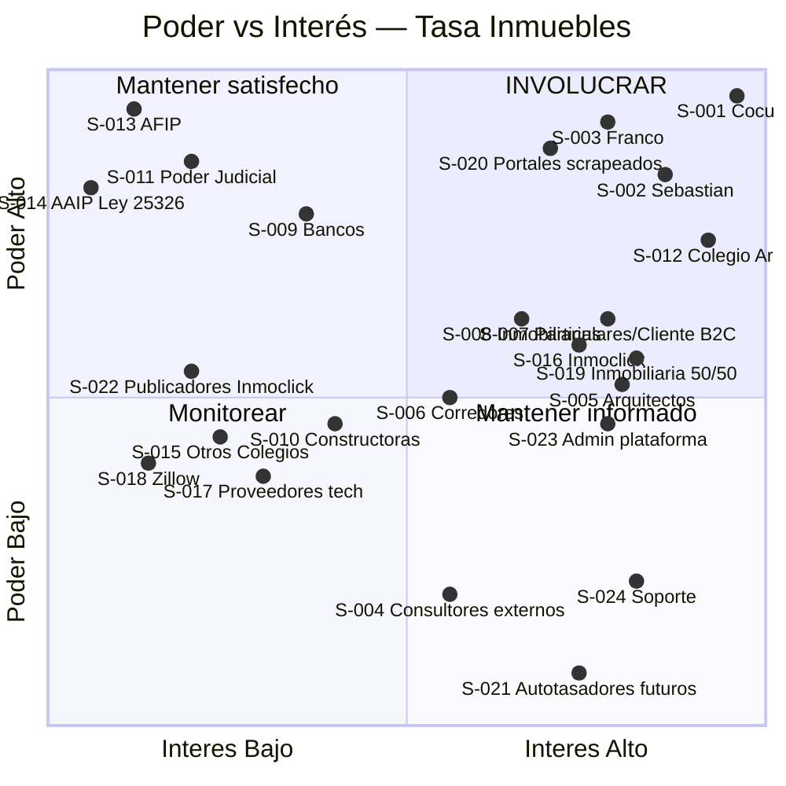

# Matriz de Stakeholders — Poder vs Interés

> Stakeholder = tenedor de apuestas. **Stakeholder ≠ usuario**. Hay stakeholders que no usan el sistema (sponsor, competidor, regulador). Esta matriz incluye obligatoriamente a los que pierden poder o margen con el producto.

## Convención

| Campo | Valor posible |
|-------|---------------|
| ID | `S-NNN` — no se reusa. |
| Tipo | humano · organización · sistema |
| Relación | cliente · usuario · sponsor · competidor · regulador · proveedor · interno-organización |
| Clase | favorecido · ignorado · desfavorecido |
| Poder | Alta · Media · Baja |
| Interés | Alto · Medio · Bajo |
| Estrategia (Mendelow) | involucrar · mantener-satisfecho · mantener-informado · monitorear |

**Heurística Mendelow:**
- Poder Alta × Interés Alto → **involucrar** (decisor clave)
- Poder Alta × Interés Bajo → **mantener satisfecho** (no enojar)
- Poder Baja × Interés Alto → **mantener informado** (aliado natural)
- Poder Baja × Interés Bajo → **monitorear** (observar cambios)

---

## Stakeholders identificados (22)

### A. Sociedad e interno del proyecto

| ID | Nombre / Rol | Tipo | Relación | Clase | Poder | Interés | Estrategia |
|----|--------------|------|----------|-------|-------|---------|------------|
| **S-001** | Cristian Cocucci — Sponsor + Visionario | humano | sponsor | favorecido | Alta | Alto | involucrar |
| **S-002** | Sebastián Ríos — Product Owner / COO | humano | interno-organización | favorecido | Alta | Alto | involucrar |
| **S-003** | Franco Bertoldi — CTO + único developer | humano | interno-organización | favorecido | Alta | Alto | involucrar |
| **S-004** | Consultores externos del ecosistema Cocucci (consultor1, consultor2) — asesoran sobre producto e integración, NO desarrollan | humano | proveedor / asesor | favorecido | Baja | Medio | mantener informado |

**Gana / pierde:**
- S-001: gana diversificación de negocio + monetización de Inmoclick + monetización de red Colegio. Pierde tiempo/atención dividida; expone know-how histórico a socios.
- S-002: gana posición societaria en producto digital + rol PO real. Pierde tiempo; reputación si fracasa.
- S-003: gana posición societaria + aplicación práctica de tesis ML + autoría arquitectónica y de implementación completa. Pierde tiempo; sin sueldo en fase inicial; **bus-factor 1** (toda la dependencia técnica concentrada en una persona).
- S-004: ganan honorarios (si aplican) + vínculo con un proyecto del ecosistema Cocucci + visibilidad. Pierden poco si el proyecto se cancela (no son su único negocio). **Su poder real sobre el proyecto es bajo y su interés es medio**: opinan e integran, pero no deciden ni construyen.

---

### B. Usuarios directos (tasadores)

| ID | Nombre / Rol | Tipo | Relación | Clase | Poder | Interés | Estrategia |
|----|--------------|------|----------|-------|-------|---------|------------|
| **S-005** | Arquitectos matriculados — usuarios MVP Fase 1 | humano | usuario | favorecido | Media | Alto | involucrar |
| **S-006** | Corredores inmobiliarios matriculados — usuarios Fase 2+ | humano | usuario | favorecido | Media | Medio | mantener satisfecho |

**Gana / pierde:**
- S-005: gana nueva fuente de ingresos (comisión 90% sobre tasaciones), herramienta gratuita, aumento de visibilidad profesional. Pierde tiempo de aprendizaje; data compartida; ranking público puede afectar reputación.
- S-006: gana herramienta diferenciadora frente a colegas que no la usan. Pierde tiempo de aprender una nueva plataforma.

---

### C. Cliente final particular (también Cliente B2C — [[T-037]])

| ID | Nombre / Rol | Tipo | Relación | Clase | Poder | Interés | Estrategia |
|----|--------------|------|----------|-------|-------|---------|------------|
| **S-007** | Particulares / Clientes B2C — usuarios activos del flujo de autotasación referencial | humano | cliente / usuario | favorecido | Media | Alto | **involucrar** |

**Cambio v3 (2026-05-14):** S-007 sube de "mantener informado" a "involucrar" porque ahora es **usuario activo del producto en MVP-6sem** vía CU-UI-014 (Tasación referencial). Antes era solo destinatario de PDF.

**Gana / pierde:**
- Gana acceso gratuito a tasaciones referenciales sin costo, vía app mobile. En Fase 2+ podrá upgrade a tasación profesional certificada. Pierde algo de contacto humano; comparte datos del inmueble con la plataforma; el valor referencial no es legalmente válido para hipotecas/sucesión/judicial (mitigado con disclaimer del PDF, BR-021).

---

### D. Clientes B2B

| ID | Nombre / Rol | Tipo | Relación | Clase | Poder | Interés | Estrategia |
|----|--------------|------|----------|-------|-------|---------|------------|
| **S-008** | Inmobiliarias B2B (caso Remax y similares) | organización | cliente | favorecido | Media | Alto | involucrar (selectivo) |
| **S-009** | Bancos | organización | cliente | favorecido | Alta | Medio | mantener satisfecho |
| **S-010** | Constructoras | organización | cliente | favorecido | Media | Bajo | monitorear |
| **S-011** | Poder Judicial / abogados (vía oficios de tasación judicial) | organización | cliente | favorecido | Alta | Bajo | mantener satisfecho |

**Gana / pierde:**
- S-008: gana dashboard agregado de tasaciones de sus sucursales, estandarización, datos. Pierde control monopólico sobre tasaciones internas; la transparencia puede ser incómoda.
- S-009: gana servicio estandarizado de tasaciones para hipotecas, volumen, trazabilidad. Paga plus por certificación; debe firmar acuerdos comerciales.
- S-010: gana tasaciones de proyectos para venta o financiamiento. Paga; comparte información comercial.
- S-011: gana tasaciones judiciales rápidas, certificadas, modelo de suscripción/bolsa mensual. Pierde poco; resistencia natural al cambio de proveedor.

---

### E. Institucional / regulador

| ID | Nombre / Rol | Tipo | Relación | Clase | Poder | Interés | Estrategia |
|----|--------------|------|----------|-------|-------|---------|------------|
| **S-012** | Colegio de Arquitectos (partner inicial — Mendoza, a confirmar jurisdicción) | organización | regulador / partner | favorecido | Alta | Alto | involucrar |
| **S-013** | AFIP — facturación electrónica e impositiva | organización | regulador | ignorado (todavía) | Alta | Bajo | mantener satisfecho |
| **S-014** | Agencia de Acceso a la Información Pública (AAIP — Ley 25.326 Protección de Datos Personales) | organización | regulador | ignorado (todavía) | Alta | Bajo | mantener satisfecho |
| **S-015** | Otros Colegios profesionales (Corredores Inmobiliarios, Arquitectos de otras provincias) | organización | regulador / partner | ignorado | Media | Bajo | monitorear |

**Gana / pierde:**
- S-012: gana servicio para sus matriculados + monetización indirecta vía membresía + modernización institucional. Pierde reputación si la herramienta es mala o si se incumplen estándares profesionales.
- S-013: gana más facturación electrónica trazable. Pierde nada. Riesgo: incumplimiento de monotributo / RG / regímenes especiales.
- S-014: gana visibilidad de cumplimiento. Riesgo: denuncia o multa si el scraping de portales o el manejo de datos personales viola Ley 25.326.
- S-015: ganan modelo replicable cuando expandamos. Pierden nada hoy.

---

### F. Sistemas / proveedores externos

| ID | Nombre / Rol | Tipo | Relación | Clase | Poder | Interés | Estrategia |
|----|--------------|------|----------|-------|-------|---------|------------|
| **S-016** | Inmoclick — base histórica (~20 años, propiedad de Cocucci) | sistema | proveedor interno | favorecido | Media | Alto | mantener informado |
| **S-017** | Proveedores tecnológicos críticos (motor IA, Google Maps, pasarela de pagos, WhatsApp Business) | sistema | proveedor | ignorado | Media | Bajo | monitorear |

**Gana / pierde:**
- S-016: aumenta valor del activo de Cocucci con nuevo caso de uso. Riesgo: si las queries de Robotomus son caras o saturan, degradación operativa.
- S-017: ingresos por uso. Riesgo: cambio de pricing, deprecación de API, lock-in.

---

### G. Competidores y desfavorecidos

| ID | Nombre / Rol | Tipo | Relación | Clase | Poder | Interés | Estrategia |
|----|--------------|------|----------|-------|-------|---------|------------|
| **S-018** | Zillow y plataformas tasación internacionales (referencia, no compiten directo en AR) | organización | competidor (indirecto) | ignorado | Media | Bajo | monitorear |
| **S-019** | Modelo tradicional de tasación inmobiliaria (tasador 50/50 con inmobiliaria) | humano | competidor (interno al rubro) | **desfavorecido** | Media | Alto | mantener informado |
| **S-020** | Portales inmobiliarios que scrapeamos (ZonaProp, ArgenProp, MercadoLibre) | organización | proveedor de datos (sin acuerdo) | **desfavorecido** | Alta | Alto (defensivo) | monitorear |

**Gana / pierde:**
- S-018: hoy ni perciben Tasa Inmuebles. Si escalamos, potencial competidor; vale monitorearlos como referencia de feature parity (Z-Value, homologación).
- S-019: **PIERDE MARGEN**. La inmobiliaria tradicional cobra la mitad de cada tasación que hace su tasador interno (modelo 50/50). Con Tasa Inmuebles, la inmobiliaria deja de cobrar el 50% (la plataforma cobra solo 10%). El tasador gana más, pero **la inmobiliaria pierde el 40% de margen sobre cada tasación**. Esto puede generar resistencia interna en cualquier Remax o cadena.
- S-020: **PIERDE CONTROL SOBRE SUS DATOS** y posiblemente clientes a futuro. Riesgo legal vivo (Franco y Cocucci discutieron Ley 25.326 explícitamente en reunión-01 — caso "le scrapeé a ZonaProp" mencionado por Franco). Ver decisiones pendientes.

---

### H. Ignorados / latentes (Fase 2-3+)

| ID | Nombre / Rol | Tipo | Relación | Clase | Poder | Interés | Estrategia |
|----|--------------|------|----------|-------|-------|---------|------------|
| **S-021** | Usuarios autotasadores futuros (particulares sin matrícula que tasan su propia casa) | humano | usuario (Fase 3+) | ignorado | Baja | Alto (latente) | monitorear |
| **S-022** | ~400 inmobiliarias publicadoras en Inmoclick (fuente de datos del modelo) | organización | proveedor de datos involuntario | **desfavorecido (silencioso)** | Media | Bajo (no saben) | monitorear |

### I. Roles internos del Back Office (Fase 2+)

| ID | Nombre / Rol | Tipo | Relación | Clase | Poder | Interés | Estrategia |
|----|--------------|------|----------|-------|-------|---------|------------|
| **S-023** | Admin de plataforma (rol interno de Tasa Inmuebles — operador del back office) — en MVP coinciden con los 3 socios; en Fase 2+ puede ser un operador dedicado | humano | interno-organización | favorecido | Media | Alto | mantener informado |
| **S-024** | Soporte / mesa de ayuda (rol interno — atiende consultas de usuarios externos) — Sebastián lo mencionó en reunión-01 como "inevitable" | humano | interno-organización | favorecido | Baja | Alto | mantener informado |

**Gana / pierde:**
- S-023: gana herramienta para administrar el sistema sin tocar código. Pierde: en MVP no existe como rol separado (lo hacen Franco/Cocucci). En Fase 2+ es un rol contratado.
- S-024: gana posibilidad de hacer su trabajo (mesa de ayuda con vista de tasaciones de cualquier user). Pierde: en MVP no existe — la mesa de ayuda es informal (los 3 socios responden por WhatsApp).

**Gana / pierde:**
- S-021: ganarán acceso a tasación referencial sin pagar tasador. Cocucci lo dijo: "hasta una ama de casa puede tasar". Hoy no es alcance del MVP-6sem. Latente.
- S-022: **PIERDEN SILENCIOSAMENTE** porque sus publicaciones de inmuebles en Inmoclick (con datos, precios, ubicación) alimentan al modelo Robotomus que compite con ellas en el negocio de tasación. Es el stakeholder más invisible y el de mayor riesgo: si descubren cómo se usan sus datos, podrían retirarse de Inmoclick (rompería la base de entrenamiento del modelo).

---

## Cuadrante Poder × Interés (Mermaid)

**Cómo leerlo:**
- **Ejes:** X = interés del stakeholder en el proyecto · Y = poder del stakeholder sobre el proyecto.
- **Coordenadas únicas por stakeholder** (jitter manual) para evitar superposición visual. Los rangos respetan el cuadrante de Mendelow al que pertenece cada uno.
- Cuadrantes:
  - **Top-right (Involucrar):** los 5 críticos del proyecto. Cocucci en la esquina extrema.
  - **Top-left (Mantener satisfecho):** reguladores con poder de veto (AFIP, AAIP) y clientes B2B grandes (Banco, Judicial).
  - **Bottom-right (Mantener informado):** consultores, particulares y usuarios latentes.
  - **Bottom-left (Monitorear):** competencia indirecta, otros colegios profesionales, proveedores tecnológicos.
  - **Frontera (alrededor de 0.5):** stakeholders ambiguos — modelo tradicional 50/50, Inmoclick, inmobiliarias B2B, arquitectos matriculados.

---

## Stakeholders no obvios (zona Fernando)

> Esta sección lista explícitamente los stakeholders que el equipo NO mencionó solo, y que son históricamente la mayor fuente de bugs de IR. Si esta sección queda vacía o débil, el análisis está incompleto.

### Los que pierden poder, margen o tareas

- **S-019 — Inmobiliarias del modelo tradicional 50/50.** Es el desfavorecido más concreto y directo del producto. El cambio de 50/50 a 90/10 desplaza margen del owner de la inmobiliaria al tasador individual. **Riesgo de boicot interno**: un dueño de inmobiliaria puede prohibirles a sus tasadores usar Tasa Inmuebles. Mitigación posible: ofrecer planes B2B donde la inmobiliaria conserve algo del margen (suscripción agregada). Decisión pendiente.
- **S-020 — Portales scrapados.** Pueden bloquear el scraping técnicamente (rate limits, captchas, fingerprinting) y/o demandar legalmente (Ley 25.326 + violación de TOS). Franco mencionó su tesis sobre ZonaProp y la frase "legalmente no se puede hacer" salió en reunión-01. Mitigación: scraping ético + acuerdos comerciales + uso preferente de Inmoclick.
- **S-022 — Inmobiliarias publicadoras en Inmoclick.** Stakeholder silencioso: sus datos alimentan al modelo competidor sin saberlo. Riesgo crítico si se entera el sector. Mitigación: revisar términos de uso históricos de Inmoclick + posiblemente anonimizar datos antes de alimentar Robotomus.

### Reguladores con poder de veto que aún no opinaron

- **S-014 — AAIP (Ley 25.326).** Tiene poder real de imponer multas y obligar a borrar datos. Aún no opinó porque no nos conoce. Mitigación obligatoria desde día 1: política de privacidad, consentimiento explícito, derecho al olvido, anonimización.
- **S-013 — AFIP.** No es bloqueante para el MVP-6sem (cobro manual), pero apenas se active el módulo contable (Fase 2) hay que cumplir factura electrónica, regímenes de IIBB, posible RG informativa por monto.
- **S-015 — Colegios profesionales de otras provincias.** No bloquean hoy, pero el día que querramos expandirnos a Buenos Aires o Córdoba habrá que firmar otros acuerdos. Vale identificar contactos tempranos.

### Competencia en sentido amplio

- **S-018 — Zillow / plataformas internacionales.** No compiten en Argentina hoy pero son benchmark obligado (Z-Value es la referencia que el propio Cocucci usó en reunión-01). Si el producto escala, podrían entrar al mercado o ser comprados.
- **Otras plataformas argentinas de tasación.** No identificadas en reunión-01. **Tarea pendiente**: relevar el mercado local. Posibles: Reporte Inmobiliario, Properati Valuaciones, herramientas internas de bancos (Galicia tasación express, etc.).

### Veto pendiente

- **S-007 — Particulares.** Tienen poder individual bajo, pero **agregado pueden generar reputación negativa**. Si las tasaciones son inconsistentes o lentas, el boca a boca destruye el producto. Mitigar con UX clara y expectativas bien comunicadas.

---

## Decisiones derivadas y pendientes

| ID | Tema | Bloquea | Resolución |
|----|------|---------|------------|
| DS-01 | Confirmar identidad real de los consultores externos del ecosistema Cocucci (S-004 = consultor1, consultor2) — NO son developers | No bloqueante (snowman v2 resuelto con placeholders) | Próxima reunión. |
| DS-02 | Modelo B2B para inmobiliarias (mitigación de S-019) | Alcance Fase 2 | Discutir con Cocucci si ofrecemos plan B2B con margen para inmobiliarias. Vincular con Q01 (modelo Entidades) y Q04 (modelo de monetización). |
| DS-03 | Estrategia legal scraping (S-020) + uso de datos Inmoclick (S-022) | Fase 2 (Robotomus) | Revisar términos legales antes de entrenar el modelo. Pendiente: opinión de abogado. |
| DS-04 | Compliance Ley 25.326 (S-014) | MVP-6sem si manejamos datos personales | Política de privacidad + consentimiento desde día 1, aunque solo sean 10 arquitectos. |
| DS-05 | Confirmar jurisdicción del Colegio (S-012) — Mendoza? Nacional? | Comunicación con sponsor | Cocucci confirma. |
| DS-06 | Relevar competencia local (otras plataformas AR de tasación) | No | Tarea de research liviana antes de Fase 2. |
| DS-07 | Elegir proveedor SMTP para mail pre-diseñado (RF-014) | Sí MVP-6sem | Candidatos: Resend, Postmark, Mailgun, SES. Decisión técnica de Franco. |
| DS-08 | **Tabla parametrizada de valor/m² por tipo × categoría × zona** (RF-016 Fitt-Servini lite) | Sí MVP-6sem | Definir junto con un arquitecto del Colegio antes del Hito 1. Sin esta tabla el cálculo da números irreales. |

---

## Resumen ejecutivo

| Métrica | Valor |
|---------|-------|
| Total stakeholders | 24 |
| Favorecidos | 16 |
| Ignorados (incluye latentes y reguladores no activos) | 5 |
| Desfavorecidos | 3 (S-019, S-020, S-022) |
| A involucrar (cuadrante 1) | 7 |
| A mantener satisfechos (cuadrante 2) | 5 |
| A mantener informados (cuadrante 4) | 3 |
| A monitorear (cuadrante 3) | 7 |

**Próximo paso recomendado:** `armar-snowman` para asignar los 6 roles DSDM dentro de los stakeholders identificados (cierra DF-01 + DS-01).
