# CU-UI-001 — Tasador crea una tasación nueva end-to-end

## Resumen

El [[T-028]] arquitecto, parado frente al inmueble, abre la app mobile, completa el relevamiento (tipo de inmueble, motivo, ubicación, solicitante, fotos, detalles, descripción) y guarda la [[T-026]]. El sistema valida campos requeridos y la deja lista para enviarse al comité de tasación.

## Actor principal

[[T-028]] Tasador (en MVP-6sem: uno de los ~10 arquitectos del Colegio).

## Actores secundarios

- [[T-021]] Plataforma (sistema).
- [[T-032]] Solicitante (referencia, no participa activamente — sus datos los carga el tasador).
- Google Maps Places API (servicio externo).

## Precondiciones

1. El tasador tiene cuenta pre-cargada por admin (CU-UI-006).
2. El tasador inició sesión en la app mobile (CU-UI-002).
3. El tasador está físicamente en o cerca del inmueble (mobile-first).
4. El dispositivo móvil tiene acceso a cámara, geolocalización y conexión a internet (3G o superior).

## Postcondiciones (estado del sistema al terminar el flujo)

### Postcondición de éxito

- Existe una [[T-026]] persistida en la base de datos en estado [[T-014]] **Inspección hecha**.
- La tasación está vinculada al tasador autor (via login).
- La tasación tiene **todos los campos requeridos completos**:
  - Identificación: `id_tasacion`, `fecha_alta`, `estado`, `tasador_id`.
  - Tipo y motivo.
  - Ubicación (`domicilio`, `latitud`, `longitud`, `modo_carga`).
  - Solicitante (nombre, apellido, teléfono; email opcional).
  - ≥ 1 foto, ≤ 15 fotos.
  - Detalles (superficie total, cubierta, dormitorios/baños si aplica, antigüedad, estado_conservacion 1-5, amenities).
  - Descripción (≥ 50 caracteres).
- La tasación es visible para el comité ([[T-006]]) en la lista "Por tasar" ([[T-022]]) de la app mobile (sección "Comité" para miembros del comité).

### Postcondición de falla

- Si el tasador abandona el flujo antes de completar, los datos parciales **se persisten en estado [[T-002]] Borrador** y el tasador puede retomar desde **[[T-033]] "Mis tasaciones"** (pantalla principal de la app mobile, home), donde verá la tasación marcada como Borrador con un botón "Continuar".

## Frecuencia esperada

MVP-6sem: ~10-30 tasaciones totales (1-3 por arquitecto). Post-MVP: alta — es el flujo más usado del producto.

## Flujo principal (camino de éxito)

| # | Actor | Acción |
|---|-------|--------|
| 1 | Tasador | En **[[T-033]] "Mis tasaciones"** (pantalla principal de la app mobile), toca el botón **"+ Nueva tasación"**. |
| 2 | Plataforma | Muestra la pantalla "Nueva tasación" (ver imagen `12.45.43(1).jpeg`) con: selector de tipo de inmueble (chips), y secciones expandibles `Motivo`, `Ubicación`, `Solicitante`, `Fotos`, `Detalles`, `Descripción`. |
| 3 | Tasador | Selecciona **Tipo de inmueble**: casa, departamento, terreno, galpón, local u oficina (RF-001). |
| 4 | Tasador | Expande sección **Motivo** y selecciona del dropdown una de las 10 opciones del catálogo (RF-002). |
| 5 | Tasador | Expande **Ubicación**. Tiene dos opciones: tocar **"Usar mi ubicación actual"** (HTML5 Geolocation API, RF-003a) o **ingresar manualmente** un domicilio con autocomplete de Google Maps Places API (RF-003b). |
| 6 | Plataforma | Geocodifica la dirección o lee las coordenadas del dispositivo. Persiste `latitud`, `longitud`, `domicilio` (string formateado), `modo_carga`. |
| 7 | Tasador | Expande **Solicitante** y completa: Nombre*, Apellido*, Teléfono* (formato AR), Email (opcional) (RF-004). |
| 8 | Tasador | Expande **Fotos** y sube entre 1 y 15 fotos del inmueble (RF-006). |
| 9 | Tasador | Expande **Detalles** y completa: superficie total (m²), superficie cubierta (m²), dormitorios (si casa/depto), baños (si casa/depto), antigüedad (años), estado de conservación (escala 1-5), amenities (lista de checkboxes) (RF-005). |
| 10 | Tasador | Expande **Descripción** y escribe un texto libre de al menos 50 caracteres describiendo el inmueble (RF-007). |
| 11 | Tasador | Toca **"Guardar cambios"**. |
| 12 | Plataforma | Valida que todos los campos requeridos estén completos (RF-008). Persiste la tasación en estado [[T-014]] Inspección hecha. Transiciona automáticamente a [[T-022]] Por tasar (CBR-015). |
| 13 | Plataforma | Muestra confirmación: "Tasación guardada. Está disponible para comité." y vuelve a **[[T-033]] "Mis tasaciones"** (pantalla principal de la app mobile). |

## Flujos alternativos

### FA-001 — Guardar como Borrador antes de completar

| # | Acción |
|---|--------|
| 5a | Tasador retrocede o pierde conexión antes de tocar "Guardar cambios". |
| 5b | Plataforma persiste los datos parciales en estado [[T-002]] **Borrador**, vinculados al tasador. |
| 5c | El tasador puede retomar desde [[T-033]] "Mis tasaciones" cuando vuelva. |

### FA-002 — Tipo de inmueble = Terreno (no aplica dormitorios/baños)

| # | Acción |
|---|--------|
| 9a | Si tipo_inmueble = `terreno`, `galpón`, `local` u `oficina`, los campos `dormitorios` y `baños` no se muestran o se marcan como N/A en el modelo. |

### FA-003 — Solicitante sin email

| # | Acción |
|---|--------|
| 7a | El tasador deja vacío el campo Email del solicitante. |
| 7b | Plataforma persiste sin email. Más tarde, en CU-UI-005 (compartir), si el tasador intenta "Enviar por mail" sin email del solicitante, el botón estará deshabilitado con tooltip "Solicitante sin email — solo descarga de PDF disponible". |

## Excepciones (rutas de error)

### E-001 — Geolocalización no disponible

| # | Acción |
|---|--------|
| 5e | HTML5 Geolocation falla (usuario denegó permiso o GPS sin señal). |
| 5e-1 | Plataforma muestra error: "No se pudo obtener tu ubicación. Ingresá el domicilio manualmente." |
| 5e-2 | El flujo continúa con paso 5b (ingreso manual con Google Maps). |

### E-002 — Foto excede tamaño máximo

| # | Acción |
|---|--------|
| 8e | Foto > N MB (a definir AC, ver pendiente). |
| 8e-1 | Plataforma rechaza la foto con error: "Foto demasiado grande. Comprimila o sacale una nueva." |
| 8e-2 | Plataforma sugiere comprimir automáticamente (opcional Fase 2). |

### E-003 — Validación falla al guardar

| # | Acción |
|---|--------|
| 12e | Al tocar "Guardar cambios" hay campos requeridos vacíos. |
| 12e-1 | Plataforma resalta los campos faltantes en rojo y muestra mensaje específico ("Falta: ubicación, ≥ 1 foto, detalles incompletos"). |
| 12e-2 | El tasador completa y vuelve a tocar "Guardar cambios". |

### E-004 — Pérdida de conexión durante guardado

| # | Acción |
|---|--------|
| 12e' | Conexión cae entre el toque de "Guardar" y la confirmación. |
| 12e'-1 | Plataforma persiste localmente (offline first opcional MVP, obligatorio Fase 2) y reintenta al recuperar conexión. |
| 12e'-2 | Si offline no implementado en MVP-6sem, se muestra error "Sin conexión. Tus datos se mantienen en pantalla. Cuando recuperes conexión, volvé a tocar Guardar." |

## Atributos de calidad relevantes (delegar a `crear-atributo-calidad`)

- **AC-001 ✓ formalizado:** tiempo total del flujo (cierre A-002). Mínimo ≤ 8 min p80, objetivo ≤ 6 min.
- **AC-002 (Fase 2):** tiempo de Robotomus real. Mínimo ≤ 5 s, objetivo ≤ 2 s. **Fuera de MVP** porque Robotomus es placeholder.
- **AC-003 ✓ formalizado:** usabilidad mobile en campo (SUS ≥ 68 + soporte ≤ 2/10).
- **AC-005 ✓ formalizado:** compliance Ley 25.326 (checklist 7/7).

## Reglas de negocio aplicadas (delegar a `crear-regla-negocio`)

- **BR-004 ✓ formalizado:** catálogo cerrado de tipos de inmueble.
- **BR-005 ✓ formalizado:** catálogo cerrado de 10 motivos de tasación.
- **BR-006 ✓ formalizado:** escala 1-5 de estado_conservacion + coeficientes Fitt-Servini.
- **BR-007 ✓ formalizado:** máximo 15 fotos por tasación.
- **BR-008 ✓ formalizado:** descripción mínima 50 caracteres.
- **BR-014 ✓ formalizado:** transición Borrador → Inspección hecha al confirmar "Guardar".
- **BR-015 ✓ formalizado:** transición Inspección hecha → Por tasar automática.

## Decisiones derivadas / pendientes

- **Q11** (pendiente, no bloqueante): nomenclatura UI Solicitante vs Referente.
- **Q12** (pendiente, no bloqueante): lista canónica de amenities.
- **AC pendiente:** tamaño máximo de cada foto (P. ej. ≤ 5 MB cada una para evitar bloat). Definir en `crear-atributo-calidad`.

## Trazabilidad inversa

Este CU se origina en los requerimientos crudos RC-011, RC-014, RC-044 a RC-050, RC-055 del transcript de reunión-01, complementados con las imágenes de la maqueta vieja `12.45.43(1).jpeg`, `12.45.44(1).jpeg`, `12.45.44(3).jpeg`.

---

<!-- AUTOGEN:trazabilidad START -->
## Trazabilidad detallada (auto-generada)

> Generado por `proyecto/wiki/diseno/generate_mvp_builder.py`. **No editar a mano** — se sobrescribe en cada corrida. Si querés modificar relaciones, editá el frontmatter `trazabilidad:` del archivo y volvé a correr el generador.

### Diagrama de flujo

```mermaid
flowchart TD
  classDef actor_tasador fill:#fee2e2,stroke:#f87171,stroke-width:1px
  classDef actor_plataforma fill:#dbeafe,stroke:#60a5fa,stroke-width:1px
  classDef actor_cliente fill:#fef3c7,stroke:#fbbf24,stroke-width:1px
  classDef actor_comite fill:#dcfce7,stroke:#10b981,stroke-width:1px
  classDef actor_admin fill:#e0e7ff,stroke:#6366f1,stroke-width:1px
  S1["<b>Tasador</b><br/>1. En 'Mis tasaciones' (pantalla principal de la app<br/>mobile), toca el botón '+ Nueva tasación'."]
  S2["<b>Plataforma</b><br/>2. Muestra la pantalla 'Nueva tasación' (ver imagen<br/>12.45.43(1).jpeg) con: selector de tipo de inmueble<br/>(chips), y secciones expandibles Motivo, Ubicación,<br/>Solicitante, Fotos, Detalles, Descripción."]
  S1 --> S2
  S3["<b>Tasador</b><br/>3. Selecciona Tipo de inmueble: casa, departamento,<br/>terreno, galpón, local u oficina (RF-001)."]
  S2 --> S3
  S4["<b>Tasador</b><br/>4. Expande sección Motivo y selecciona del dropdown una<br/>de las 10 opciones del catálogo (RF-002)."]
  S3 --> S4
  S5["<b>Tasador</b><br/>5. Expande Ubicación. Tiene dos opciones: tocar 'Usar<br/>mi ubicación actual' (HTML5 Geolocation API, RF-003a) o<br/>ingresar manualmente un domicilio con autocomplete de<br/>Google Maps Places API (RF-003b)."]
  S4 --> S5
  S6["<b>Plataforma</b><br/>6. Geocodifica la dirección o lee las coordenadas del<br/>dispositivo. Persiste latitud, longitud, domicilio<br/>(string formateado), modo_carga."]
  S5 --> S6
  S7["<b>Tasador</b><br/>7. Expande Solicitante y completa: Nombre, Apellido,<br/>Teléfono* (formato AR), Email (opcional) (RF-004)."]
  S6 --> S7
  S8["<b>Tasador</b><br/>8. Expande Fotos y sube entre 1 y 15 fotos del inmueble<br/>(RF-006)."]
  S7 --> S8
  S9["<b>Tasador</b><br/>9. Expande Detalles y completa: superficie total (m²),<br/>superficie cubierta (m²), dormitorios (si casa/depto),<br/>baños (si casa/depto), antigüedad (años), estado de<br/>conservación (escala 1-5), amenities (lista de<br/>checkboxes) (RF-005)."]
  S8 --> S9
  S10["<b>Tasador</b><br/>10. Expande Descripción y escribe un texto libre de al<br/>menos 50 caracteres describiendo el inmueble (RF-007)."]
  S9 --> S10
  S11["<b>Tasador</b><br/>11. Toca 'Guardar cambios'."]
  S10 --> S11
  S12["<b>Plataforma</b><br/>12. Valida que todos los campos requeridos estén<br/>completos (RF-008). Persiste la tasación en estado<br/>Inspección hecha. Transiciona automáticamente a Por<br/>tasar (CBR-015)."]
  S11 --> S12
  S13["<b>Plataforma</b><br/>13. Muestra confirmación: 'Tasación guardada. Está<br/>disponible para comité.' y vuelve a 'Mis tasaciones'<br/>(pantalla principal de la app mobile)."]
  S12 --> S13
  class S1,S3,S4,S5,S7,S8,S9,S10,S11 actor_tasador
  class S2,S6,S12,S13 actor_plataforma
```

### Referencias salientes

#### Resuelve problema de negocio

- [BR-NEG-001](../05_negocio/BR-NEG-001.md) — Reducir tiempo y fricción de tasaciones inmobiliarias certificadas

#### Implementado por (RF)

- [RF-001](../07_software/RF/RF-001.md) — Seleccionar tipo de inmueble
- [RF-002](../07_software/RF/RF-002.md) — Capturar motivo de tasación
- [RF-003](../07_software/RF/RF-003.md) — Geolocalizar inmueble
- [RF-004](../07_software/RF/RF-004.md) — Capturar datos del solicitante
- [RF-005](../07_software/RF/RF-005.md) — Capturar detalles del inmueble
- [RF-006](../07_software/RF/RF-006.md) — Subir fotos del inmueble
- [RF-007](../07_software/RF/RF-007.md) — Capturar descripción del inmueble
- [RF-008](../07_software/RF/RF-008.md) — Validar y guardar tasación
- [RF-009](../07_software/RF/RF-009.md) — Transicionar a "Por tasar" / enviar a comité

#### Verificado por (AC)

- [AC-001](../07_software/NF/AC-001.md) — Tiempo total del flujo Nueva Tasación (profesional)
- [AC-003](../07_software/NF/AC-003.md) — Usabilidad mobile en campo
- [AC-005](../07_software/NF/AC-005.md) — Compliance con Ley 25.326 (Protección de Datos Personales)

#### Sujeto a reglas de negocio (BR software)

- [BR-004](../07_software/BR/BR-004.md) — Catálogo cerrado de tipos de inmueble
- [BR-005](../07_software/BR/BR-005.md) — Catálogo cerrado de 10 motivos de tasación
- [BR-006](../07_software/BR/BR-006.md) — Escala ordinal estado_conservacion + coeficientes Fitt-Servini
- [BR-007](../07_software/BR/BR-007.md) — Restricción de cantidad máxima de fotos por tasación
- [BR-008](../07_software/BR/BR-008.md) — Restricción de longitud mínima de descripción
- [BR-014](../07_software/BR/BR-014.md) — Hecho: transición Borrador → Inspección hecha
- [BR-015](../07_software/BR/BR-015.md) — Hecho: transición automática Inspección hecha → Por tasar

### Referencias entrantes

#### Atributos de Calidad

- [AC-001](../07_software/NF/AC-001.md) — Tiempo total del flujo Nueva Tasación (profesional) *(via `cu_origen`)*
- [AC-003](../07_software/NF/AC-003.md) — Usabilidad mobile en campo *(via `cu_origen`)*

#### Reglas de Negocio (Negocio)

- [BR-NEG-001](../05_negocio/BR-NEG-001.md) — Reducir tiempo y fricción de tasaciones inmobiliarias certificadas *(via `usuario`)*

<!-- AUTOGEN:trazabilidad END -->
