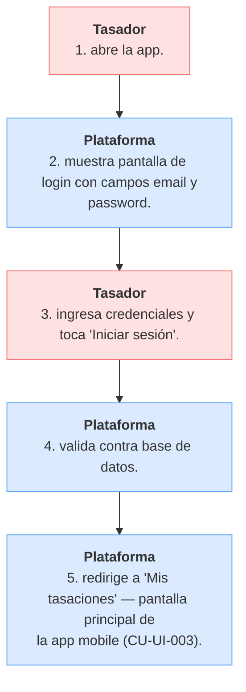

# CU-UI-002 — Tasador inicia sesión en la plataforma

## Actor principal
[[T-028]] Tasador (arquitecto MVP).

## Precondiciones
- El admin ya pre-cargó la cuenta del tasador (CU-UI-006).
- El tasador recibió sus credenciales (email + password inicial) por canal externo (WhatsApp/mail).

## Flujo principal
1. Tasador abre la app.
2. Plataforma muestra pantalla de login con campos `email` y `password`.
3. Tasador ingresa credenciales y toca "Iniciar sesión".
4. Plataforma valida contra base de datos.
5. Plataforma redirige a [[T-033]] **"Mis tasaciones"** — pantalla principal de la app mobile (CU-UI-003).

## Postcondición de éxito
- Sesión autenticada (JWT estándar con claim `sub`).
- Tasador queda con permisos de su rol.

## Excepciones
- E-001 — credenciales inválidas → mensaje "Email o contraseña incorrectos".
- E-002 — sin conexión → mensaje "Sin conexión. Reintentá."

## Fuera del MVP-6sem
Autoregistro, SSO, magic links, MFA, recuperación de contraseña. Ver A-011 resuelta.

## Trazabilidad
Implementa BR-NEG-001 (visión). Contribuye al Hito 1 (ver `00_fundamentos.md`). Se descompone en RF-010.

---

<!-- AUTOGEN:trazabilidad START -->
## Trazabilidad detallada (auto-generada)

> Generado por `proyecto/wiki/diseno/generate_mvp_builder.py`. **No editar a mano** — se sobrescribe en cada corrida. Si querés modificar relaciones, editá el frontmatter `trazabilidad:` del archivo y volvé a correr el generador.

### Diagrama de flujo

### Referencias salientes

#### Resuelve problema de negocio

- [BR-NEG-001](../05_negocio/BR-NEG-001.md) — Reducir tiempo y fricción de tasaciones inmobiliarias certificadas

#### Implementado por (RF)

- [RF-010](../07_software/RF/RF-010.md) — Login con email + password

### Referencias entrantes

#### Atributos de Calidad

- [AC-003](../07_software/NF/AC-003.md) — Usabilidad mobile en campo *(via `cu_origen`)*
- [AC-005](../07_software/NF/AC-005.md) — Compliance con Ley 25.326 (Protección de Datos Personales) *(via `cu_origen`)*
- [AC-012](../07_software/NF/AC-012.md) — Performance de carga inicial de la app mobile *(via `cu_origen`)*

#### Reglas de Negocio (Negocio)

- [BR-NEG-001](../05_negocio/BR-NEG-001.md) — Reducir tiempo y fricción de tasaciones inmobiliarias certificadas *(via `usuario`)*

<!-- AUTOGEN:trazabilidad END -->
