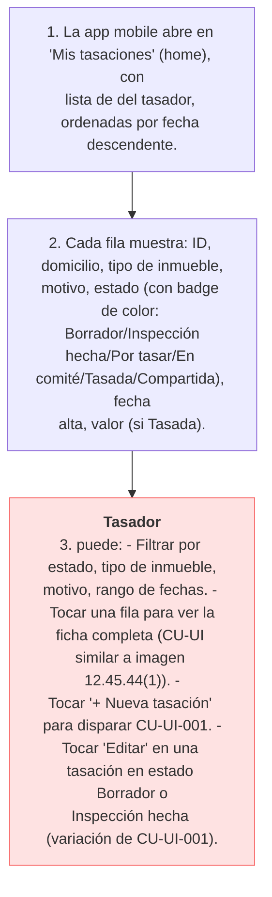

# CU-UI-003 — Tasador consulta sus tasaciones ("Mis tasaciones", pantalla principal de la app mobile)

## Actor principal
[[T-028]] Tasador.

## Precondiciones
- Tasador autenticado (CU-UI-002).

## Flujo principal
1. La app mobile abre en [[T-033]] **"Mis tasaciones"** (home), con lista de [[T-026]] del tasador, ordenadas por fecha descendente.
2. Cada fila muestra: ID, domicilio, tipo de inmueble, motivo, estado (con badge de color: Borrador/Inspección hecha/Por tasar/En comité/Tasada/Compartida), fecha alta, valor (si Tasada).
3. Tasador puede:
   - Filtrar por estado, tipo de inmueble, motivo, rango de fechas.
   - Tocar una fila para ver la ficha completa (CU-UI similar a imagen 12.45.44(1)).
   - Tocar "+ Nueva tasación" para disparar CU-UI-001.
   - Tocar "Editar" en una tasación en estado Borrador o Inspección hecha (variación de CU-UI-001).

## Importante
Esto **no es un dashboard** en el sentido de la versión web del Owner (T-034). Es la **pantalla principal de la app mobile** — equivalente al `home` de cualquier app móvil. No hay versión web del tasador en el MVP.

## Postcondición de éxito
- Tasador ve estado actual de sus tasaciones.

## Fuera del MVP-6sem
- KPIs avanzados (tasaciones del mes, comparación mes anterior, zonas más tasadas) — RC-039, RC-040 a Fase 2.
- Métricas configurables — RC-042 a Fase 2.
- Multi-tenant selector — RC-041 a Fase 2.

## Trazabilidad
Implementa BR-NEG-001 (visión). Contribuye al Hito 1 (ver `00_fundamentos.md`). Se descompone en RF-011.

---

<!-- AUTOGEN:trazabilidad START -->
## Trazabilidad detallada (auto-generada)

> Generado por `proyecto/wiki/diseno/generate_mvp_builder.py`. **No editar a mano** — se sobrescribe en cada corrida. Si querés modificar relaciones, editá el frontmatter `trazabilidad:` del archivo y volvé a correr el generador.

### Diagrama de flujo

### Referencias salientes

#### Resuelve problema de negocio

- [BR-NEG-001](../05_negocio/BR-NEG-001.md) — Reducir tiempo y fricción de tasaciones inmobiliarias certificadas

#### Implementado por (RF)

- [RF-011](../07_software/RF/RF-011.md) — Listar tasaciones del tasador ("Mis tasaciones", pantalla principal app mobile)

### Referencias entrantes

#### Atributos de Calidad

- [AC-003](../07_software/NF/AC-003.md) — Usabilidad mobile en campo *(via `cu_origen`)*

#### Reglas de Negocio (Negocio)

- [BR-NEG-001](../05_negocio/BR-NEG-001.md) — Reducir tiempo y fricción de tasaciones inmobiliarias certificadas *(via `usuario`)*

<!-- AUTOGEN:trazabilidad END -->
