# CU-UI-004 — Comité de tasación cierra el valor final

## Actor principal
[[T-006]] Comité de tasación (en MVP: 3 socios + el [[T-028]] autor de la tasación, ~4 personas).

## Precondiciones
- Existe una [[T-026]] en estado [[T-022]] Por tasar.
- Los miembros del comité están autenticados.

## Flujo principal (MVP-6sem, versión manual)

**Canal en MVP-6sem:** app mobile (los 3 socios + el arquitecto autor acceden desde sus celulares). La versión web del comité es post-MVP.

1. Cualquier participante del comité abre la app mobile, va a la sección "Comité" (lista "Por tasar"), elige la tasación y entra a la pestaña "Comité de tasación" (ver imagen 12.45.44(1)).
2. Plataforma muestra todos los datos del relevamiento: tipo, motivo, ubicación, solicitante, fotos (carousel), detalles, descripción.
3. Plataforma muestra los dos índices:
   - **Valor referencial Robotomus** ([[T-029]]): en MVP = "no calculado" o "promedio fake" (RC-053). Etiqueta visible: "Robotomus (en desarrollo)".
   - **Valor técnico Fitt-Servini** ([[T-030]]): **calculado automáticamente** por RF-016 al guardar la tasación. Visible en USD + ARS con el desglose (valor_construccion + valor_terreno) y los coeficientes aplicados (estado_conservación, antigüedad, frente/fondo).
4. Cada participante puede agregar observaciones en un campo de texto compartido.
5. El comité discute (en sala o videoconferencia — fuera del sistema) y consensúa un valor final.
6. Un participante con permiso (en MVP cualquiera del comité) define el valor final:
   - **Opción A (aceptar Fitt-Servini):** toca "Usar valor Fitt-Servini" → `valor_final = valor_tecnico` automáticamente.
   - **Opción B (override manual):** ingresa manualmente el valor en ARS y/o USD + (opcional) deja un `override_motivo` en texto libre.
7. Participante confirma "Cerrar valor".
8. Plataforma transiciona la tasación a estado [[T-027]] Tasada.

## Postcondición de éxito
- La tasación queda en estado Tasada con `valor_ARS`, `valor_USD`, `fecha_tasacion`, `participantes_comite`.
- Habilitado el botón "Generar PDF" / "Compartir" (CU-UI-005).

## Diferenciador para el Colegio

El **valor técnico Fitt-Servini calculado automáticamente** (RF-016) es el diferenciador clave del MVP: los arquitectos ven el cálculo listo al abrir el comité, en vez de hacerlo a mano. Coherente con el espíritu profesional del producto.

## Fuera del MVP-6sem
- Robotomus real (Fase 2, dual-track).
- ~~Cálculo automático del valor técnico Fitt-Servini~~ ✓ **AGREGADO al MVP el 2026-05-14** (decisión de Franco — la fórmula es determinística, costo controlado, alto diferenciador). Ver RF-016.
- Indicador 4-niveles de calidad Robotomus (nula/regular/buena/excelente) — RC-051 → Fase 2.
- Votación electrónica individual por participante — DP-010 pendiente.
- Videoconferencia integrada — explícitamente fuera de alcance.
- Refinamiento de Fitt-Servini: coef frente/fondo dinámico, depreciación no-lineal, tipo de cambio API — todo Fase 2.

## Trazabilidad
Implementa BR-NEG-001 (visión). Contribuye al Hito 1 (ver `00_fundamentos.md`). Se descompone en RF-015.

---

<!-- AUTOGEN:trazabilidad START -->
## Trazabilidad detallada (auto-generada)

> Generado por `proyecto/wiki/diseno/generate_mvp_builder.py`. **No editar a mano** — se sobrescribe en cada corrida. Si querés modificar relaciones, editá el frontmatter `trazabilidad:` del archivo y volvé a correr el generador.

### Diagrama de flujo

```mermaid
flowchart TD
  classDef actor_tasador fill:#fee2e2,stroke:#f87171,stroke-width:1px
  classDef actor_plataforma fill:#dbeafe,stroke:#60a5fa,stroke-width:1px
  classDef actor_cliente fill:#fef3c7,stroke:#fbbf24,stroke-width:1px
  classDef actor_comite fill:#dcfce7,stroke:#10b981,stroke-width:1px
  classDef actor_admin fill:#e0e7ff,stroke:#6366f1,stroke-width:1px
  S1["1. Cualquier participante del comité abre la app<br/>mobile, va a la sección 'Comité' (lista 'Por tasar'),<br/>elige la tasación y entra a la pestaña 'Comité de<br/>tasación' (ver imagen 12.45.44(1))."]
  S2["<b>Plataforma</b><br/>2. muestra todos los datos del relevamiento: tipo,<br/>motivo, ubicación, solicitante, fotos (carousel),<br/>detalles, descripción."]
  S1 --> S2
  S3["<b>Plataforma</b><br/>3. muestra los dos índices: - Valor referencial<br/>Robotomus (): en MVP = 'no calculado' o 'promedio fake'<br/>(RC-053). Etiqueta visible: 'Robotomus (en<br/>desarrollo)'. - Valor técnico Fitt-Servini ():<br/>calculado automáticamente por RF-016 al guardar la<br/>tasación. Visible en USD + ARS con el desglose<br/>(valor_construccion + valor_terreno) y los coeficientes<br/>aplicados (estado_conservación, antigüedad,<br/>frente/fondo)."]
  S2 --> S3
  S4["4. Cada participante puede agregar observaciones en un<br/>campo de texto compartido."]
  S3 --> S4
  S5["5. El comité discute (en sala o videoconferencia —<br/>fuera del sistema) y consensúa un valor final."]
  S4 --> S5
  S6["6. Un participante con permiso (en MVP cualquiera del<br/>comité) define el valor final: - Opción A (aceptar<br/>Fitt-Servini): toca 'Usar valor Fitt-Servini' →<br/>valor_final = valor_tecnico automáticamente. - Opción B<br/>(override manual): ingresa manualmente el valor en ARS<br/>y/o USD + (opcional) deja un override_motivo en texto<br/>libre."]
  S5 --> S6
  S7["7. Participante confirma 'Cerrar valor'."]
  S6 --> S7
  S8["<b>Plataforma</b><br/>8. transiciona la tasación a estado Tasada."]
  S7 --> S8
  class S2,S3,S8 actor_plataforma
```

### Referencias salientes

#### Resuelve problema de negocio

- [BR-NEG-001](../05_negocio/BR-NEG-001.md) — Reducir tiempo y fricción de tasaciones inmobiliarias certificadas

#### Implementado por (RF)

- [RF-015](../07_software/RF/RF-015.md) — Cerrar valor final en comité
- [RF-016](../07_software/RF/RF-016.md) — Calcular valor técnico vía fórmula Fitt-Servini

### Referencias entrantes

#### Atributos de Calidad

- [AC-003](../07_software/NF/AC-003.md) — Usabilidad mobile en campo *(via `cu_origen`)*

#### Reglas de Negocio (Negocio)

- [BR-NEG-001](../05_negocio/BR-NEG-001.md) — Reducir tiempo y fricción de tasaciones inmobiliarias certificadas *(via `usuario`)*

<!-- AUTOGEN:trazabilidad END -->
