# CU-UI-005 — Tasador comparte la tasación con el solicitante

## Actor principal
[[T-028]] Tasador.

## Actores secundarios
- [[T-032]] Solicitante (recibe el PDF, no interactúa con la plataforma).
- Proveedor SMTP externo (Resend, Postmark u otro — DS-07).

## Precondiciones
- Existe una [[T-026]] en estado [[T-027]] Tasada (valor cerrado por el comité, CU-UI-004).
- Si se va a usar "Enviar por mail", el solicitante tiene email registrado.

## Flujo principal
1. Tasador abre la tasación desde [[T-033]] "Mis tasaciones" (pantalla principal de la app mobile).
2. Plataforma muestra botón **"Generar PDF y compartir"**.
3. Tasador toca el botón.
4. Plataforma genera un PDF con: ID tasación, datos del inmueble, ubicación, fotos, valor en ARS y USD, fecha, firma "Tasa Inmuebles" + IDs del comité y del tasador autor.
5. Plataforma muestra dos opciones:
   - **A) Descargar PDF** (siempre disponible, opción A).
   - **C) Enviar por mail al solicitante** (disponible solo si el solicitante tiene email).
6. Tasador elige una o ambas opciones.

### Opción A — Descargar
- 6a. Plataforma genera el PDF y lo descarga al dispositivo del tasador.
- 6b. El tasador lo comparte por su cuenta (WhatsApp, mail externo, papel).

### Opción C — Enviar por mail
- 6c. Plataforma muestra mail pre-diseñado con: destinatario = email del solicitante, asunto = "Tasación de [domicilio] — Tasa Inmuebles", cuerpo = texto template + PDF adjunto.
- 6d. Tasador puede previsualizar el mail antes de enviar.
- 6e. Tasador confirma "Enviar".
- 6f. Plataforma envía vía proveedor SMTP y persiste registro de envío (timestamp, destinatario, status).
- 6g. Plataforma muestra confirmación "Mail enviado".

## Postcondición de éxito
- La tasación pasa al estado [[T-007]] Compartida.
- Si se envió por mail, el sistema persiste el registro de envío (auditoría).
- El PDF queda persistido y descargable nuevamente desde la ficha.

## Fuera del MVP-6sem
- **Link único auditable con token** (opción B, descartada en A-016).
- Notificación a la app del solicitante (no hay app de cliente en MVP).
- Múltiples destinatarios.
- WhatsApp Business API como canal.

## Riesgo asumido
Sin link único auditable, **no sabemos cuándo el solicitante abrió el PDF**. Si Fase 2 los clientes B2B lo exigen, se agrega.

## Trazabilidad
Implementa BR-NEG-001 (visión). Contribuye al Hito 1 (ver `00_fundamentos.md`). Se descompone en RF-012 (generar PDF), RF-013 (descargar), RF-014 (enviar mail).

---

<!-- AUTOGEN:trazabilidad START -->
## Trazabilidad detallada (auto-generada)

> Generado por `proyecto/wiki/diseno/generate_mvp_builder.py`. **No editar a mano** — se sobrescribe en cada corrida. Si querés modificar relaciones, editá el frontmatter `trazabilidad:` del archivo y volvé a correr el generador.

### Diagrama de flujo

```mermaid
flowchart TD
  classDef actor_tasador fill:#fee2e2,stroke:#f87171,stroke-width:1px
  classDef actor_plataforma fill:#dbeafe,stroke:#60a5fa,stroke-width:1px
  classDef actor_cliente fill:#fef3c7,stroke:#fbbf24,stroke-width:1px
  classDef actor_comite fill:#dcfce7,stroke:#10b981,stroke-width:1px
  classDef actor_admin fill:#e0e7ff,stroke:#6366f1,stroke-width:1px
  S1["<b>Tasador</b><br/>1. abre la tasación desde 'Mis tasaciones' (pantalla<br/>principal de la app mobile)."]
  S2["<b>Plataforma</b><br/>2. muestra botón 'Generar PDF y compartir'."]
  S1 --> S2
  S3["<b>Tasador</b><br/>3. toca el botón."]
  S2 --> S3
  S4["<b>Plataforma</b><br/>4. genera un PDF con: ID tasación, datos del inmueble,<br/>ubicación, fotos, valor en ARS y USD, fecha, firma<br/>'Tasa Inmuebles' + IDs del comité y del tasador autor."]
  S3 --> S4
  S5["<b>Plataforma</b><br/>5. muestra dos opciones: - A) Descargar PDF (siempre<br/>disponible, opción A). - C) Enviar por mail al<br/>solicitante (disponible solo si el solicitante tiene<br/>email)."]
  S4 --> S5
  S6["<b>Tasador</b><br/>6. elige una o ambas opciones. ### Opción A — Descargar<br/>- 6a. Plataforma genera el PDF y lo descarga al<br/>dispositivo del tasador. - 6b. El tasador lo comparte<br/>por su cuenta (WhatsApp, mail externo, papel). ###<br/>Opción C — Enviar por mail - 6c. Plataforma muestra<br/>mail pre-diseñado con: destinatario = email del<br/>solicitante, asunto = 'Tasación de [domicilio] — Tasa<br/>Inmuebles', cuerpo = texto template + PDF adjunto. -<br/>6d. Tasador puede previsualizar el mail antes de<br/>enviar. - 6e. Tasador confirma 'Enviar'. - 6f.<br/>Plataforma envía vía proveedor SMTP y persiste registro<br/>de envío (timestamp, destinatario, status). - 6g.<br/>Plataforma muestra confirmación 'Mail enviado'."]
  S5 --> S6
  class S1,S3,S6 actor_tasador
  class S2,S4,S5 actor_plataforma
```

### Referencias salientes

#### Resuelve problema de negocio

- [BR-NEG-001](../05_negocio/BR-NEG-001.md) — Reducir tiempo y fricción de tasaciones inmobiliarias certificadas

#### Implementado por (RF)

- [RF-012](../07_software/RF/RF-012.md) — Generar PDF de tasación
- [RF-013](../07_software/RF/RF-013.md) — Descargar PDF (opción A de "Compartir")
- [RF-014](../07_software/RF/RF-014.md) — Enviar PDF por mail al solicitante (opción C de "Compartir")

### Referencias entrantes

#### Atributos de Calidad

- [AC-003](../07_software/NF/AC-003.md) — Usabilidad mobile en campo *(via `cu_origen`)*
- [AC-005](../07_software/NF/AC-005.md) — Compliance con Ley 25.326 (Protección de Datos Personales) *(via `cu_origen`)*

#### Reglas de Negocio (Negocio)

- [BR-NEG-001](../05_negocio/BR-NEG-001.md) — Reducir tiempo y fricción de tasaciones inmobiliarias certificadas *(via `usuario`)*

<!-- AUTOGEN:trazabilidad END -->
