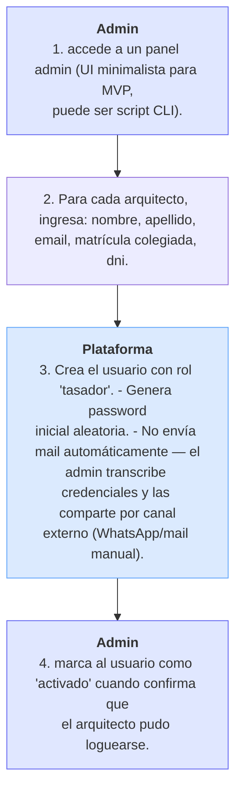

# CU-UI-006 — Admin pre-carga usuarios (arquitectos del Colegio)

> **Nota**: este es el **único caso administrativo** que entra al MVP-6sem. En Fase 2 se absorbe dentro de **CU-UI-017 Back Office** como una función más del módulo "A — Usuarios e identidad".

## Actor principal
**S-023 Admin de plataforma** (en MVP-6sem coincide con Franco o Cocucci — todavía no es un rol contratado dedicado).

## Precondiciones
- Lista de los ~10 arquitectos confirmada por el Colegio (DP-006 pendiente, **bloqueante MVP**).

## Flujo principal
1. Admin accede a un panel admin (UI minimalista para MVP, puede ser script CLI).
2. Para cada arquitecto, ingresa: nombre, apellido, email, matrícula colegiada, dni.
3. Plataforma:
   - Crea el usuario con rol "tasador".
   - Genera password inicial aleatoria.
   - **No envía mail** automáticamente — el admin transcribe credenciales y las comparte por canal externo (WhatsApp/mail manual).
4. Admin marca al usuario como "activado" cuando confirma que el arquitecto pudo loguearse.

## Postcondición de éxito
- Los 10 arquitectos del Colegio tienen cuenta en la plataforma con rol "tasador".
- Todos pueden ejecutar CU-UI-002 (login).

## Fuera del MVP-6sem
- Onboarding asistido (autoregistro + validación de matrícula automática) → Fase 2 vía **CU-UI-017** módulo A.
- Ranking + reviews de tasadores → Fase 3.
- Verificación contra API del Colegio → Fase 2-3.
- Email de bienvenida automático → Fase 2.

## Implementación sugerida MVP
- **Recomendado MVP**: script `seed_users.py` que toma un CSV y crea usuarios en DB. Cero UI.
- Alternativa: tabla mínima `/admin/users` con CRUD básico (pero ya estaríamos haciendo embrión de back office antes de tiempo).

## Roadmap operativo
- **MVP-6sem (Hito 1)**: script CLI ejecutado por Franco. Genera credenciales aleatorias, las exporta a un CSV que Cocucci comparte por WhatsApp con cada arquitecto.
- **Fase 2 (post-Hito 1)**: la función se absorbe en **CU-UI-017 Back Office**. Misma función pero con UI, con permisos de S-023 Admin de plataforma, con auditoría.

## Trazabilidad
Implementa BR-NEG-001 (visión). Contribuye al Hito 1 (ver `00_fundamentos.md`). No genera RF nuevos (es un caso operativo del admin, no del producto core).

---

<!-- AUTOGEN:trazabilidad START -->
## Trazabilidad detallada (auto-generada)

> Generado por `proyecto/wiki/diseno/generate_mvp_builder.py`. **No editar a mano** — se sobrescribe en cada corrida. Si querés modificar relaciones, editá el frontmatter `trazabilidad:` del archivo y volvé a correr el generador.

### Diagrama de flujo

### Referencias salientes

#### Resuelve problema de negocio

- [BR-NEG-001](../05_negocio/BR-NEG-001.md) — Reducir tiempo y fricción de tasaciones inmobiliarias certificadas

<!-- AUTOGEN:trazabilidad END -->
