# CU-UI-014 — Cliente B2C realiza una Tasación Referencial desde la app mobile

## Resumen

Un [[T-037]] **Cliente B2C** (particular sin matrícula profesional) abre la app mobile, se autoregistra con email + password, completa los datos de su inmueble en un formulario simplificado y obtiene un PDF de **[[T-036]] Tasación referencial** con valor calculado automáticamente vía [[T-030]] Valor técnico (Fitt-Servini) + [[T-029]] Valor de mercado (Robotomus mock en MVP). El PDF lleva disclaimer fuerte de "no certificada profesionalmente".

## Actor principal

[[T-037]] **Cliente B2C** (autoregistrado).

## Actores secundarios

- [[T-021]] Plataforma (sistema).
- Proveedor SMTP (Resend / Postmark / etc. — DS-07) si el cliente elige recibir PDF por email.

## Precondiciones

1. El Cliente B2C tiene la app mobile instalada en su celular.
2. El Cliente B2C abre la app y, en la pantalla de bienvenida con CTA bifurcado (RF-017), toca **"Soy Cliente / Quiero tasar mi propiedad"**.
3. El Cliente B2C completa el autoregistro (RF-018): email + password + acepta términos.

## Postcondiciones

### Postcondición de éxito

- Existe una [[T-026]] con `tipo_tasacion = "referencial"` persistida en BD.
- La tasación está en estado [[T-038]] **Generada**, vinculada al `cliente_b2c_id` del autor.
- Tiene `valor_tecnico_USD` y `valor_tecnico_ARS` calculados por RF-016 (Fitt-Servini lite).
- Tiene `valor_robotomus_placeholder` (mock).
- Tiene PDF generado y disponible para descarga / envío por mail.
- La tasación es visible en la pantalla "Mis tasaciones referenciales" del Cliente B2C.

### Postcondición de falla

- Si el Cliente B2C abandona el formulario, los datos parciales **se persisten en estado [[T-002]] Borrador** vinculados a su cuenta. Puede retomar.

## Flujo principal (nivel valor)

1. Cliente B2C abre la app mobile sin sesión activa.
2. App muestra pantalla de bienvenida con CTA bifurcado (RF-017):
   - **"Soy Tasador (arquitecto matriculado)"** → flujo CU-UI-002 (login profesional).
   - **"Soy Cliente / Quiero tasar mi propiedad"** → flujo de autoregistro (RF-018).
3. Cliente B2C elige el camino [B] y se autoregistra (RF-018): email, password, "acepto términos y consentimiento de datos (Ley 25.326)".
4. Plataforma crea cuenta con `role = cliente_b2c` y redirige al home: **"Mis tasaciones referenciales"**.
5. Cliente B2C toca **"+ Nueva tasación referencial"**.
6. App muestra formulario simplificado (RF-019):
   - Tipo de inmueble (chips reusados de RF-001).
   - **Ubicación: campo de texto manual** (sin Google Maps, sin geolocalización — decisión 2026-05-14).
   - Detalles (RF-005 reusado: superficie total, superficie cubierta, dormitorios, baños, antigüedad, conservación 1-5, amenities).
   - Descripción (RF-007 reusado, mínimo 50 caracteres).
   - **Fotos: opcionales** (sin requisito mínimo para reducir fricción).
7. Cliente B2C completa y toca **"Calcular valor"**.
8. Plataforma valida campos requeridos.
9. Plataforma persiste la tasación en estado [[T-002]] Borrador, dispara cálculo:
   - RF-016 → calcula valor técnico Fitt-Servini lite.
   - Mock Robotomus → devuelve `valor_robotomus_placeholder` (constante hardcoded MVP).
10. Plataforma transiciona la tasación al estado [[T-038]] **Generada**.
11. Plataforma genera PDF de Tasación referencial (RF-020) con disclaimer "No certificada profesionalmente. Para certificación, consulte con un tasador colegiado."
12. App muestra resultado:
    - Valor técnico (ARS / USD).
    - Valor referencial Robotomus (ARS / USD — placeholder MVP).
    - Botón "Descargar PDF" (descarga directa).
    - Botón "Enviar PDF a mi email" (vía proveedor SMTP).
13. Cliente B2C descarga o envía. Tasación pasa a [[T-007]] Compartida.

## Flujos alternativos

### FA-001 — Cliente B2C ya autenticado (re-uso)
- 1a. Si el Cliente B2C ya tiene sesión activa (token válido), salta pasos 2-4 y va directo al home.

### FA-002 — Cliente B2C abandona el formulario
- 7a. Cliente cierra la app antes de tocar "Calcular".
- 7b. Plataforma persiste como Borrador. Al volver, ve la tasación marcada como "Borrador — continuar".

### FA-003 — Sin email del cliente al enviar PDF
- 12a. El email del cliente es el email de autoregistro (RF-018). Si el cliente quiere enviarlo a otra dirección, puede sobrescribirlo en el modal de envío.

## Excepciones

### E-001 — Validación falla
- 8e. Falta algún campo requerido → resalta en rojo + mensaje.

### E-002 — Cálculo Fitt-Servini falla (zona desconocida en tabla)
- 9e. Si la zona no está en la tabla `valor_m2_terreno` (DS-08), el sistema aplica el valor "zona desconocida" (fallback configurable) y flagea en el PDF "valor estimado con datos genéricos por falta de zona específica".

### E-003 — Email inválido durante autoregistro
- 3e. Validación de formato; sin verificación por email en MVP (Fase 2 suma).

## Lo que NO entra en MVP-6sem

- **Pago**: la tasación referencial es **gratuita en MVP**. En Fase 2+ se podrá cobrar.
- **Upgrade a certificada**: si el cliente quiere firma colegiada, en Fase 2 podrá pagar plus + se asigna tasador colegiado para inspección ocular (CU-UI-012).
- **Geolocalización automática**: ingreso manual obligatorio en MVP.
- **Captación web pública (SEO)**: Fase 2 con landing web standalone.
- **Verificación de email**: el autoregistro acepta cualquier email válido en formato; verificación es Fase 2.
- **Magic links / OTP / SSO**: solo email + password en MVP.

## Diferenciador para el Colegio

Mostrar **autotasación referencial gratuita pública en la misma app** refuerza el pitch al Colegio: el producto ya **demuestra el caso "Uber + Autotasador en una sola plataforma"**. Coherente con la visión de transcript:L223 (Cocucci): "que vos fueses tu propio tasador".

## Reglas de negocio aplicadas

- BR-006 (escala estado_conservacion 1-5 con coeficientes Fitt-Servini).
- BR-019 (fórmula Fitt-Servini lite).
- **BR-021 (nuevo, pendiente)**: Toda Tasación referencial debe llevar disclaimer "No certificada profesionalmente" en el PDF.
- BR-022 (nuevo, pendiente): Cliente B2C ve solo sus propias tasaciones referenciales (no las de otros clientes ni las profesionales).

## Atributos de calidad

- AC-001 (tiempo flujo end-to-end) — más laxo para B2C (12 min ok, no exige 8 min como tasador).
- AC-003 (usabilidad mobile) — sí aplica.
- **AC-013 (nuevo, pendiente)**: Performance del cálculo Fitt-Servini en mobile (cliente bajo condiciones de red variables, target ≤ 5 s).

## Trazabilidad

- **Negocio**: BR-NEG-001 (visión).
- **Hito**: 00_fundamentos.md § Métrica de éxito (Hito 1).
- **Software**:
  - RF-017 (CTA bifurcado / pantalla bienvenida).
  - RF-018 (autoregistro Cliente B2C).
  - RF-019 (captura Tasación referencial).
  - RF-020 (generar PDF referencial).
  - RF-016 (Fitt-Servini — reusado de profesional).
  - RF-005, RF-007 (detalles + descripción — reusados).

---

<!-- AUTOGEN:trazabilidad START -->
## Trazabilidad detallada (auto-generada)

> Generado por `proyecto/wiki/diseno/generate_mvp_builder.py`. **No editar a mano** — se sobrescribe en cada corrida. Si querés modificar relaciones, editá el frontmatter `trazabilidad:` del archivo y volvé a correr el generador.

### Diagrama de flujo

```mermaid
flowchart TD
  classDef actor_tasador fill:#fee2e2,stroke:#f87171,stroke-width:1px
  classDef actor_plataforma fill:#dbeafe,stroke:#60a5fa,stroke-width:1px
  classDef actor_cliente fill:#fef3c7,stroke:#fbbf24,stroke-width:1px
  classDef actor_comite fill:#dcfce7,stroke:#10b981,stroke-width:1px
  classDef actor_admin fill:#e0e7ff,stroke:#6366f1,stroke-width:1px
  S1["<b>Cliente B2C</b><br/>1. abre la app mobile sin sesión activa."]
  S2["<b>App</b><br/>2. muestra pantalla de bienvenida con CTA bifurcado<br/>(RF-017): - 'Soy Tasador (arquitecto matriculado)' →<br/>flujo CU-UI-002 (login profesional). - 'Soy Cliente /<br/>Quiero tasar mi propiedad' → flujo de autoregistro<br/>(RF-018)."]
  S1 --> S2
  S3["<b>Cliente B2C</b><br/>3. elige el camino [B] y se autoregistra (RF-018):<br/>email, password, 'acepto términos y consentimiento de<br/>datos (Ley 25.326)'."]
  S2 --> S3
  S4["<b>Plataforma</b><br/>4. crea cuenta con role = cliente_b2c y redirige al<br/>home: 'Mis tasaciones referenciales'."]
  S3 --> S4
  S5["<b>Cliente B2C</b><br/>5. toca '+ Nueva tasación referencial'."]
  S4 --> S5
  S6["<b>App</b><br/>6. muestra formulario simplificado (RF-019): - Tipo de<br/>inmueble (chips reusados de RF-001). - Ubicación: campo<br/>de texto manual (sin Google Maps, sin geolocalización —<br/>decisión 2026-05-14). - Detalles (RF-005 reusado:<br/>superficie total, superficie cubierta, dormitorios,<br/>baños, antigüedad, conservación 1-5, amenities). -<br/>Descripción (RF-007 reusado, mínimo 50 caracteres). -<br/>Fotos: opcionales (sin requisito mínimo para reducir<br/>fricción)."]
  S5 --> S6
  S7["<b>Cliente B2C</b><br/>7. completa y toca 'Calcular valor'."]
  S6 --> S7
  S8["<b>Plataforma</b><br/>8. valida campos requeridos."]
  S7 --> S8
  S9["<b>Plataforma</b><br/>9. persiste la tasación en estado Borrador, dispara<br/>cálculo: - RF-016 → calcula valor técnico Fitt-Servini<br/>lite. - Mock Robotomus → devuelve<br/>valor_robotomus_placeholder (constante hardcoded MVP)."]
  S8 --> S9
  S10["<b>Plataforma</b><br/>10. transiciona la tasación al estado Generada."]
  S9 --> S10
  S11["<b>Plataforma</b><br/>11. genera PDF de Tasación referencial (RF-020) con<br/>disclaimer 'No certificada profesionalmente. Para<br/>certificación, consulte con un tasador colegiado.'"]
  S10 --> S11
  S12["<b>App</b><br/>12. muestra resultado: - Valor técnico (ARS / USD). -<br/>Valor referencial Robotomus (ARS / USD — placeholder<br/>MVP). - Botón 'Descargar PDF' (descarga directa). -<br/>Botón 'Enviar PDF a mi email' (vía proveedor SMTP)."]
  S11 --> S12
  S13["<b>Cliente B2C</b><br/>13. descarga o envía. Tasación pasa a Compartida."]
  S12 --> S13
  class S1,S3,S5,S7,S13 actor_cliente
  class S2,S4,S6,S8,S9,S10,S11,S12 actor_plataforma
```

### Referencias salientes

#### Resuelve problema de negocio

- [BR-NEG-001](../05_negocio/BR-NEG-001.md) — Reducir tiempo y fricción de tasaciones inmobiliarias certificadas

#### Implementado por (RF)

- [RF-017](../07_software/RF/RF-017.md) — Pantalla de bienvenida con CTA bifurcado
- [RF-018](../07_software/RF/RF-018.md) — Autoregistro de Cliente B2C (email + password)
- [RF-019](../07_software/RF/RF-019.md) — Captura de Tasación Referencial (Cliente B2C)
- [RF-020](../07_software/RF/RF-020.md) — Generar PDF de Tasación Referencial
- [RF-016](../07_software/RF/RF-016.md) — Calcular valor técnico vía fórmula Fitt-Servini

### Referencias entrantes

#### Atributos de Calidad

- [AC-003](../07_software/NF/AC-003.md) — Usabilidad mobile en campo *(via `cu_origen`)*
- [AC-005](../07_software/NF/AC-005.md) — Compliance con Ley 25.326 (Protección de Datos Personales) *(via `cu_origen`)*
- [AC-012](../07_software/NF/AC-012.md) — Performance de carga inicial de la app mobile *(via `cu_origen`)*
- [AC-013](../07_software/NF/AC-013.md) — Performance del cálculo Fitt-Servini + render de resultado (flujo Cliente B2C) *(via `cu_origen`)*

#### Reglas de Negocio (Negocio)

- [BR-NEG-001](../05_negocio/BR-NEG-001.md) — Reducir tiempo y fricción de tasaciones inmobiliarias certificadas *(via `usuario`)*

<!-- AUTOGEN:trazabilidad END -->
