# 09 — Trazabilidad completa N ↔ U ↔ S ↔ Tests

> Matriz bidireccional generada por `trazabilidad-completa` el 2026-05-14. Permite responder preguntas en ambas direcciones:
>
> - **Subida (validación)**: ¿qué CU implementa este RF? ¿qué BR-NEG justifica este CU?
> - **Bajada (impacto)**: si cambia este BR-NEG, ¿qué CU/RF se afectan?

## Resumen ejecutivo

```
Universo de artefactos (MVP-6sem):
  Negocio (BR-NEG):       3 nodos
  Usuario (CU-UI):        17 nodos (6 Must MVP + 1 Must operativo + 10 esqueleto Fase 2/3)
  Software (RF):          20 nodos
  Software (AC):           5 nodos
  Software (BR):          14 nodos
  Globales (RG):           6 nodos aprobados + 1 diferido a Fase 2
  Stakeholders (S):       24 nodos (referencia)

Total nodos: 60 (sin contar stakeholders)
Total edges: 87 (vínculos en ambas direcciones)

Cobertura Negocio → Software MVP: 100%
  Todos los 7 CU-UI Must MVP tienen RF asociados (excepto CU-UI-006 admin operativo).
  Todos los RF MVP están vinculados a al menos 1 CU-UI Must.
```

## Diagrama Mermaid (alto nivel: BR-NEG → CU-UI → RF MVP)

```mermaid
flowchart TD
    %% Nivel Negocio
    BRNEG001["BR-NEG-001<br/>Visión: reducir fricción tasaciones"]
    BRNEG003["BR-NEG-003<br/>Acuerdo Colegio 6 meses"]
    BRNEG004["BR-NEG-004<br/>Comisión 90/10"]

    %% Nivel Usuario MVP (Must)
    CUUI001["CU-UI-001<br/>Nueva tasación profesional<br/>(fully-dressed)"]
    CUUI002["CU-UI-002<br/>Login tasador"]
    CUUI003["CU-UI-003<br/>Mis tasaciones (home mobile)"]
    CUUI004["CU-UI-004<br/>Comité cierra valor"]
    CUUI005["CU-UI-005<br/>Compartir PDF"]
    CUUI006["CU-UI-006<br/>Admin pre-carga 10 arquitectos"]
    CUUI014["CU-UI-014<br/>Autotasador Cliente B2C"]

    %% Nivel Software RF MVP (grupos por CU)
    subgraph RFsCU001["RF de CU-UI-001 (Nueva tasación)"]
        RF001["RF-001<br/>Tipo inmueble"]
        RF002["RF-002<br/>Motivo"]
        RF003["RF-003<br/>Geolocalizar"]
        RF004["RF-004<br/>Solicitante"]
        RF005["RF-005<br/>Detalles"]
        RF006["RF-006<br/>Fotos"]
        RF007["RF-007<br/>Descripción"]
        RF008["RF-008<br/>Validar y guardar"]
        RF009["RF-009<br/>Por tasar"]
    end

    subgraph RFsCU002["RF de CU-UI-002 (Login)"]
        RF010["RF-010<br/>Login email+pass"]
    end

    subgraph RFsCU003["RF de CU-UI-003 (Mis tasaciones)"]
        RF011["RF-011<br/>Listar tasaciones"]
    end

    subgraph RFsCU004["RF de CU-UI-004 (Comité)"]
        RF015["RF-015<br/>Cerrar valor"]
        RF016["RF-016<br/>Fitt-Servini lite"]
    end

    subgraph RFsCU005["RF de CU-UI-005 (Compartir)"]
        RF012["RF-012<br/>Generar PDF profesional"]
        RF013["RF-013<br/>Descargar PDF"]
        RF014["RF-014<br/>Enviar PDF mail"]
    end

    subgraph RFsCU014["RF de CU-UI-014 (Autotasador)"]
        RF017["RF-017<br/>CTA bifurcado"]
        RF018["RF-018<br/>Autoregistro B2C"]
        RF019["RF-019<br/>Captura referencial"]
        RF020["RF-020<br/>PDF referencial"]
    end

    %% Edges Negocio → Usuario
    BRNEG001 --> CUUI001
    BRNEG001 --> CUUI002
    BRNEG001 --> CUUI003
    BRNEG001 --> CUUI004
    BRNEG001 --> CUUI005
    BRNEG001 --> CUUI014
    BRNEG003 -.-> CUUI006
    BRNEG003 -.-> CUUI002

    %% Edges Usuario → Software MVP
    CUUI001 --> RF001
    CUUI001 --> RF002
    CUUI001 --> RF003
    CUUI001 --> RF004
    CUUI001 --> RF005
    CUUI001 --> RF006
    CUUI001 --> RF007
    CUUI001 --> RF008
    CUUI001 --> RF009
    CUUI001 --> RF016
    CUUI002 --> RF010
    CUUI002 --> RF017
    CUUI003 --> RF011
    CUUI004 --> RF015
    CUUI004 --> RF016
    CUUI005 --> RF012
    CUUI005 --> RF013
    CUUI005 --> RF014
    CUUI014 --> RF017
    CUUI014 --> RF018
    CUUI014 --> RF019
    CUUI014 --> RF020
    CUUI014 --> RF016

    %% Styling
    classDef negocio fill:#1F3A5F,stroke:#fff,color:#fff
    classDef usuario fill:#2E75B6,stroke:#fff,color:#fff
    classDef software fill:#70AD47,stroke:#fff,color:#fff

    class BRNEG001,BRNEG003,BRNEG004 negocio
    class CUUI001,CUUI002,CUUI003,CUUI004,CUUI005,CUUI006,CUUI014 usuario
    class RF001,RF002,RF003,RF004,RF005,RF006,RF007,RF008,RF009,RF010,RF011,RF012,RF013,RF014,RF015,RF016,RF017,RF018,RF019,RF020 software
```



> **Nota**: el diagrama omite los **CU-UI esqueleto de Fase 2/3** (CU-UI-007 a 013, 015, 016, 017) que no tienen RF en MVP. También omite la capa AC y BR para legibilidad — ver tablas detalladas abajo para esas referencias.

## Tablas detalladas

### N → U: BR-NEG → CU-UI

| BR-NEG | CU-UI vinculados | Fase de los CU |
|--------|------------------|----------------|
| **BR-NEG-001** Visión | CU-UI-001, CU-UI-002, CU-UI-003, CU-UI-004, CU-UI-005, CU-UI-014 | 6 CU MVP |
| **BR-NEG-003** Acuerdo Colegio | CU-UI-006 (indirecto: define los 10 arquitectos), CU-UI-002 (login restringido a tasador del Colegio) | 2 CU MVP (vínculo indirecto) |
| **BR-NEG-004** Comisión 90/10 | CU-UI-015 (suscripción B2B) | 1 CU Fase 3 |

### U → S: CU-UI Must MVP → RF

| CU-UI | RF Must MVP vinculados | Total RF |
|-------|------------------------|----------|
| **CU-UI-001** Nueva tasación | RF-001, RF-002, RF-003, RF-004, RF-005, RF-006, RF-007, RF-008, RF-009, RF-016 | 10 |
| **CU-UI-002** Login | RF-010, RF-017 (compartido) | 2 |
| **CU-UI-003** Mis tasaciones | RF-011 | 1 |
| **CU-UI-004** Comité | RF-015, RF-016 (compartido) | 2 |
| **CU-UI-005** Compartir | RF-012, RF-013, RF-014 | 3 |
| **CU-UI-006** Admin pre-carga | (sin RF — admin operativo, ver justificación en CU) | 0 |
| **CU-UI-014** Autotasador B2C | RF-016 (compartido), RF-017, RF-018, RF-019, RF-020 | 5 |

**Total único de RF MVP cubiertos: 20/20 (RF-001..RF-020).**

### U → S: CU-UI Fase 2/3 → RF

Estos CU-UI son esqueletos sin RF MVP. Los RF se desarrollarán en Fase 2 o 3 cuando se trabajen los subsistemas correspondientes.

| CU-UI | Fase | RF previstos (a desarrollar) |
|-------|------|------------------------------|
| **CU-UI-007** Cliente solicita tasación web | Fase 2 | RF a definir |
| **CU-UI-008** Robotomus real | Fase 2 (dual-track) | RF a definir |
| **CU-UI-009** Asignación auto por zona | Fase 2 | RF a definir |
| **CU-UI-010** Dashboard Owner B2B | Fase 2 | RF a definir |
| **CU-UI-011** Pasarela de pagos | Fase 2 | RF a definir (módulo contable) |
| **CU-UI-012** Tasación certificada con inspección ocular | Fase 2 | RF a definir |
| **CU-UI-013** Entrenamiento Robotomus | Fase 2 (dual-track) | RF a definir |
| **CU-UI-015** Suscripción B2B | Fase 3 | RF a definir |
| **CU-UI-016** Ranking + reviews | Fase 3 | RF a definir |
| **CU-UI-017** Back Office | Fase 2 | RF a definir (CRUDs admin) |

### S → S: RF → AC

| RF | AC vinculados |
|----|---------------|
| RF-001 | AC-003 |
| RF-002 | AC-003 |
| RF-003 | AC-003 |
| RF-004 | AC-003, AC-005 |
| RF-005 | AC-003 |
| RF-006 | AC-001, AC-003 |
| RF-007 | AC-003 |
| RF-008 | AC-001, AC-003, AC-005 |
| RF-009 | AC-001 |
| RF-010 | AC-005, AC-012 |
| RF-011 | AC-003, AC-012 |
| RF-012 | AC-001 |
| RF-013 | AC-005 |
| RF-014 | AC-005 |
| RF-015 | AC-001 |
| RF-016 | AC-013 |
| RF-017 | AC-003, AC-012 |
| RF-018 | AC-003, AC-005 |
| RF-019 | AC-003, AC-013 |
| RF-020 | AC-001, AC-005 |

### S → S: RF → BR

| RF | BR vinculados | sin_br_aplicable |
|----|---------------|------------------|
| RF-001 | BR-004 | |
| RF-002 | BR-005 | |
| RF-003 | — | ✓ justificado |
| RF-004 | — | ✓ justificado |
| RF-005 | BR-004, BR-006 | |
| RF-006 | BR-007 | |
| RF-007 | BR-008 | |
| RF-008 | BR-006, BR-007, BR-008, BR-014 | |
| RF-009 | BR-015 | |
| RF-010 | BR-002, BR-009 | |
| RF-011 | — | ✓ justificado |
| RF-012 | — | ✓ justificado |
| RF-013 | — | ✓ justificado |
| RF-014 | — | ✓ justificado |
| RF-015 | BR-018 | |
| RF-016 | BR-006, BR-019 | |
| RF-017 | — | ✓ justificado |
| RF-018 | BR-022 | |
| RF-019 | BR-006, BR-007, BR-008, BR-019, BR-022 | |
| RF-020 | BR-021 | |

### S → Tests

> **Estado MVP-6sem**: tests NO existen todavía. La generación de tests se hace **después del handoff a SDD** (`ir-handoff-sdd` → `sandinas-wiki-skills` → TDD durante implementación).

| RF | Tests previstos (TDD post-handoff) | Estado |
|----|-------------------------------------|--------|
| RF-001..RF-020 | TC-RF-NNN-001, TC-RF-NNN-002, ... (mínimo 2 por RF según política TDD del proyecto) | Pendiente — Fase implementación |

**Placeholders generados**: ninguno todavía en MVP. La trazabilidad RF→Test se genera al ejecutar `sandinas-dev-workflows:writing-plans` que produce tests primero.

### Globales: RG aplicables a todos los RF

**6 RG aprobados formalmente el 2026-05-14** por Franco Bertoldi (CTO). Aplican transversalmente sin overrides documentados.

| RG | Aplica a | Override |
|----|----------|----------|
| **RG-001** Moneda + tipo de cambio | RF-012, RF-015, RF-016, RF-019, RF-020 (valores monetarios) | Ninguno |
| **RG-002** Precisión decimal 2 + half-up | RF-015, RF-016, RF-019 (cálculos monetarios) | Ninguno |
| **RG-003** TLS 1.2+ | **TODOS los RF** (transporte) | Ninguno |
| **RG-004** Audit trail | **TODOS los RF que persisten** | Ninguno |
| **RG-005** Validación input | **TODOS los endpoints API** | Ninguno |
| **RG-006** Logs estructurados JSON | **TODOS los RF backend** | Ninguno |

**RG-007 i18n: diferido a Fase 2.** MVP-6sem solo es-AR. Alternativa MVP: mantener strings consolidados en `messages.ts`.

## Detección de huérfanos

### Huérfanos por tipo

| Tipo | Detectados | Esperado / No esperado |
|------|------------|------------------------|
| **BR-NEG sin CU directo** | 0 (BR-NEG-003 está vinculado indirecto pero cumple) | ✓ esperado |
| **CU sin RF (MVP Must)** | 1 (CU-UI-006 admin operativo) | ✓ esperado (justificado en CU-UI-006) |
| **CU sin RF (Fase 2/3)** | 10 (CU-UI-007..013, 015, 016, 017) | ✓ esperado (esqueletos) |
| **RF sin AC** | 0 | — |
| **RF sin BR (sin marcador)** | 0 | — |
| **RF sin CU origen** | 0 | — |
| **AC huérfano (sin RF que lo use)** | 0 | — |
| **BR huérfana (sin RF que la use)** | 1 (BR-001 Comisión 90/10) | ✓ esperado (Fase 2, modelo declarado) |
| **Tests huérfanos** | N/A | Tests post-handoff |
| **Stakeholders sin uso MVP** | 15 (Fase 2-3) | ✓ esperado (latentes / Fase 2+) |

### Stakeholders activos en MVP (con CU/RF en los que aparecen)

| Stakeholder | Aparece en |
|-------------|-----------|
| **S-001** Cocucci | CU-UI-001, 004, 005, 014 (sponsor y participante de comité) |
| **S-002** Sebastián | CU-UI-001, 004, 014 (PO y participante de comité) |
| **S-003** Franco | CU-UI-001, 002, 004, 006, 014 (CTO y participante de comité) |
| **S-005** Arquitectos del Colegio | CU-UI-001..005 (usuario primario MVP) |
| **S-007** Cliente B2C | CU-UI-005, 014 (autotasador en MVP) |
| **S-012** Colegio | CU-UI-001, 014 (sponsor institucional) |

### Stakeholders sin uso MVP (latentes Fase 2+)

S-004 (consultores), S-006 (corredores), S-008-S-011 (clientes B2B), S-013-S-015 (reguladores), S-016 (Inmoclick), S-017 (proveedores tech), S-018-S-022 (varios Fase 2/3), S-023-S-024 (Back Office). Total: 15 stakeholders latentes.

## Cobertura

```
Cobertura Negocio → Software MVP: 100%
  Todos los 6 CU-UI Must orientados al MVP-6sem (excluyendo CU-UI-006 operativo) tienen ≥ 1 RF.
  Todos los 20 RF MVP están vinculados a al menos 1 CU.

Cobertura terna (RF + AC + BR):  100%
  Validado por validar-terna el 2026-05-14.

Cobertura Stakeholders → MVP:  6/24 (25%) — esperado, MVP es subset acotado.

Cobertura Tests:  0%  ← se genera post-handoff con TDD
```

## Reporte de impacto: si cambia un BR-NEG

> Tabla "what-if" para análisis de impacto pre-decisión.

| Si cambia... | Se afectan estos CU-UI | Y estos RF |
|--------------|-------------------------|-------------|
| **BR-NEG-001** Visión | TODOS los 6 CU Must MVP | TODOS los 20 RF MVP |
| **BR-NEG-003** Acuerdo Colegio | CU-UI-006 (alta usuarios), CU-UI-002 (login restringido) | RF-010 (login), RF-018 (autoregistro B2C) |
| **BR-NEG-004** Comisión 90/10 | CU-UI-015 (Fase 3) | RF de cobro (Fase 2, todavía no existe) |

## Próximo paso

`ir-handoff-sdd` — preparar `12_handoff-sdd/manifest.md` que mapea los artefactos IR a destinos en `sandinas-wiki-skills` (`01_alcance_funcional.md`, `02_arquitectura.md`, `crear-flujo`, `crear-rf` final).
