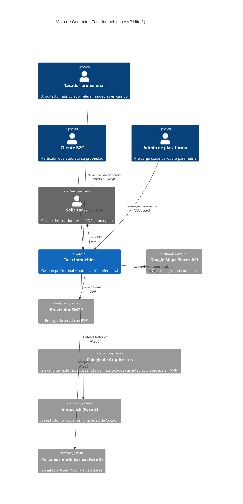
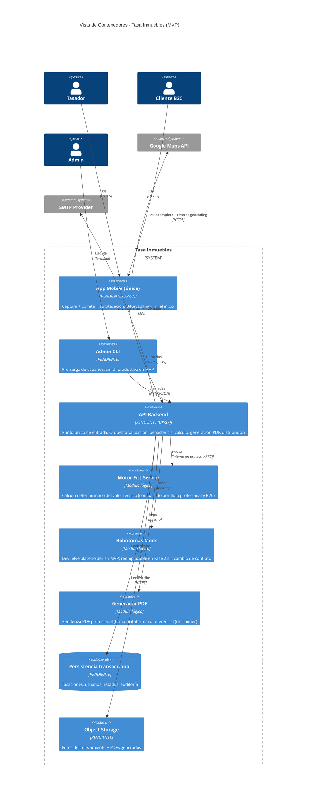
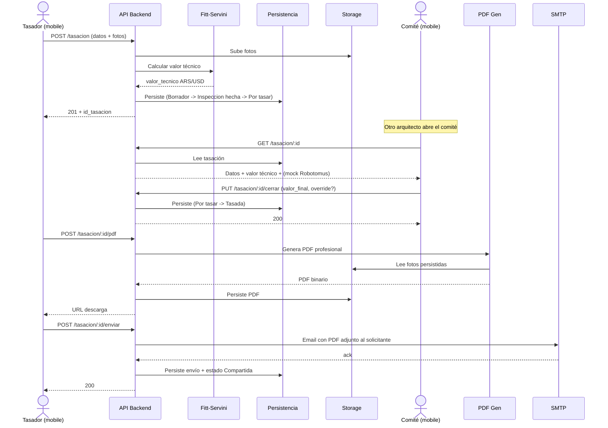
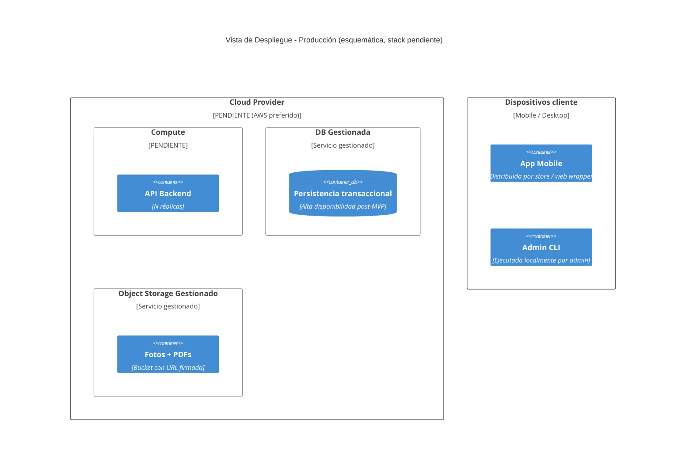

# Arquitectura — Tasa Inmuebles (Proyecto Cocucci)

> Documento de arquitectura del MVP Hito 1 (target ~2026-06-25). Diseñado para ser **portable a stack**: ninguna decisión de lenguaje, framework, motor de base de datos o proveedor cloud está cerrada todavía (DP-S7 pendiente). La estructura lógica descrita acá debe seguir siendo válida una vez que el stack se cierre.
>
> **Estado**: arquitectura prematura generada el 2026-05-15. Consume `01_alcance_funcional.md`. Se actualiza al cerrar DP-S7, DS-07, DP-006 y Q02.

---

## 0. Prioridad de Decisiones del Proyecto

> Fuente de verdad para decisiones de tradeoff y para políticas en `AGENTS.md` / `CLAUDE.md`. Derivada del contexto del proyecto (CLAUDE.md + transcript reunión-01). **Revisar con el PO (Sebastián Ríos) en la próxima sesión** — orden marcado como derivado, no aprobado.

**Orden**: `Mantenibilidad > Seguridad > Costo > Performance > Estabilidad`

| # | Categoría | Razón |
|---|---|---|
| 1 | **Mantenibilidad** | Equipo de 1 desarrollador (Franco) hasta el Hito 1. La velocidad de feature delivery depende de código simple, fronteras claras, sin abstracciones prematuras. Vale más que rendir el último milisegundo. |
| 2 | **Seguridad / Compliance** | Ley 25.326 obligatoria (AC-005 compliance 7/7). Datos personales del solicitante y del cliente B2C; valores monetarios persistidos; integridad transaccional inviolable. |
| 3 | **Costo** | Proyecto autofinanciado por la sociedad. Sesgo declarado por el CTO a herramientas open source y planes gratuitos siempre que sea viable. |
| 4 | **Performance** | AC-001 laxo (8 min p80 para todo el flujo de captura mobile). Volumen MVP bajo (~30 tasaciones totales). No es un sistema low-latency en el MVP. |
| 5 | **Estabilidad** | Piloto cerrado de ~10 usuarios. Tolerancia razonable a ventanas de mantenimiento. SLA estricto se eleva en Fase 2 cuando entran clientes B2B reales. |

---

## 1. Resumen Ejecutivo

Tasa Inmuebles ejecuta tasaciones inmobiliarias profesionales (matriculados + comité de validación + PDF firmado) y referenciales (autoservicio B2C con disclaimer). Ambos productos conviven en una única plataforma mobile-first.

El Hito 1 (~2026-06-25) demuestra el flujo completo end-to-end con ~10 arquitectos del Colegio sobre tasaciones reales. El stack final está abierto (DP-S7); esta arquitectura define el **mapa lógico** que sobrevive a la elección de tecnologías.

**Decisiones de arquitectura cerradas en este documento** (detalle en §7 y `ADR/`):

1. **Una sola app mobile bifurcada por rol** (tasador profesional + cliente B2C) en lugar de dos apps separadas.
2. **Mobile-only en MVP**: sin app desktop ni web pública en Hito 1; back office y dashboards B2B se difieren a Fase 2.
3. **Comunicación síncrona** en todo el camino crítico del MVP; mensajería asíncrona se reserva para Fase 2 (cuando entre Robotomus real).
4. **Almacenamiento separado** para blobs (fotos + PDFs) vs estado transaccional.
5. **Monolito modular** como pista preferida para MVP (vs microservicios), reservando la división a Fase 2 cuando el dominio madure.
6. **Stack tecnológico diferido** (DP-S7): la arquitectura es agnóstica de lenguaje/framework.

---

## 2. Vista de Contexto (C4 Nivel 1)

---

## 3. Vista de Contenedores (C4 Nivel 2)

### 3.1 Topología de aplicaciones por dispositivo

> Respuesta directa a la consigna del usuario: **qué app convive en qué dispositivo**.

| Dispositivo | Tipo de App | Rol asociado | Estado |
|---|---|---|---|
| Mobile (Android / iOS) del tasador | **App Mobile única**, bifurcada por rol al inicio de sesión | Tasador profesional (login con credenciales pre-cargadas) | **Incluido en MVP** |
| Mobile (Android / iOS) del cliente B2C | **Misma App Mobile**, rama bifurcada al autoregistro | Cliente B2C (autoregistro libre) | **Incluido en MVP** |
| Desktop / notebook del admin | **CLI / script administrativo** (sin UI productiva) | Admin de plataforma (Franco / Cocucci) para pre-carga de los ~10 arquitectos | **Incluido en MVP** |
| Mobile del solicitante | **Ninguna app dedicada** | Solicitante recibe PDF por email; no opera el sistema | N/A |
| Desktop del owner B2B (banco, inmobiliaria, constructora) | **Web App de dashboards** | Owners de entidades B2B con KPIs agregados | **Fase 2** |
| Mobile del owner B2B | **Misma Web App, responsiva** (sin app nativa dedicada) | Owners en movilidad | **Fase 2** |
| Desktop del admin (post-MVP) | **Web App de back office** (reemplaza la CLI) | Admin con UI completa, auditoría, gestión multi-entidad | **Fase 2** |

**Decisión clave de la topología (ADR-001)**: una sola app mobile bifurcada por rol en lugar de dos apps separadas (tasador vs B2C). Reduce superficie de mantenimiento a la mitad, permite mostrar el dual track en el pitch al Colegio y respeta la prioridad Mantenibilidad.

### 3.2 Contenedores internos

**Nota sobre módulos lógicos**: Motor Fitt-Servini, Robotomus Mock y Generador PDF están dibujados como contenedores separados pero **no necesariamente son procesos separados**. Pueden materializarse como módulos del monolito (MVP) o como servicios independientes (Fase 2) — la decisión depende del stack final (DP-S7) y se cierra en ADR-006.

---

## 4. Secuencia Crítica — Flujo "Tasación profesional end-to-end"

**Camino de error** (resumen):
- Falla geocoding → tasador completa domicilio manualmente.
- Pérdida de conexión durante upload de fotos → reintento manual; en MVP no hay offline-first.
- SMTP cae al enviar → tasación queda en Tasada (no transiciona a Compartida); reintento manual por el tasador.
- Race condition entre dos miembros del comité cerrando valor → primer commit gana; segundo recibe 409 con valor cerrado. Detalle en Q02 pendiente.

---

## 5. Responsabilidad de Componentes

| Componente | Responsabilidad principal | Datos/estado que gobierna | Dependencias clave |
|---|---|---|---|
| App Mobile | UI/UX para tasador y cliente B2C: captura, edición, listado, generación de PDF, descarga, envío. Bifurcación por rol al inicio de sesión. | Estado de sesión local, borrador local opcional | API Backend, Google Maps |
| Admin CLI | Pre-carga de usuarios profesionales (~10 en MVP) y operaciones administrativas one-shot | Ninguno propio | API Backend |
| API Backend | Punto único de entrada del backend. Orquesta autenticación, validación, persistencia, cálculo Fitt-Servini, generación PDF, distribución por SMTP. Resuelve transiciones de estado. | Identidad de sesión, transacciones de tasación, auditoría | Persistencia, Storage, Fitt-Servini, Robotomus Mock, PDF Gen, SMTP |
| Motor Fitt-Servini | Cálculo determinístico del valor técnico aplicando fórmula del Colegio. Compartido entre flujo profesional y B2C | Tabla de coeficientes por zona/categoría (lectura) | Persistencia (solo lectura) |
| Robotomus Mock | Devuelve placeholder de valor de mercado en MVP. Contrato estable para reemplazo en Fase 2 sin cambiar consumidores | Constante mock | Ninguna en MVP |
| Generador PDF | Renderiza PDF profesional (con firma de plataforma + IDs comité y tasador) o referencial (con disclaimer "no certificada profesionalmente") | Templates de PDF | Storage (fotos), Persistencia (datos de tasación) |
| Persistencia transaccional | Almacena tasaciones, usuarios, estados, auditoría. Garantiza ACID en transiciones críticas (cierre de comité, envío) | Todas las entidades transaccionales | Ninguna |
| Object Storage | Almacena fotos del relevamiento y PDFs generados. Acceso vía URL firmada | Blobs binarios | Ninguna |

---

## 6. Stack Tecnológico

> **Estado**: todas las decisiones de tecnología están **diferidas** (DP-S7). Esta tabla documenta qué hay que decidir, con qué motivo alineado a la Prioridad de Decisiones, y qué riesgo cubrir.

| Componente | Tecnología | Motivo (alineado a Prioridad) | Riesgo principal | Mitigación |
|---|---|---|---|---|
| App Mobile | **PENDIENTE (DP-S7).** Sin decidir entre nativa, híbrida (RN / Flutter) o web responsiva mobile-first | Acceso a cámara, GPS, carga de fotos; DX rápida para equipo chico (Mantenibilidad) | Re-trabajo de UI si se cambia post-MVP | Capa de abstracción mínima sobre APIs nativas |
| Admin CLI | **PENDIENTE.** Probablemente comparta runtime con backend | Reuso de modelos/validación del backend | Inconsistencias si se separa | Definir contrato compartido |
| API Backend | **PENDIENTE (DP-S7).** Sin decidir lenguaje/framework | Soporte REST/HTTP + ORM/persistencia + comunidad OSS madura (Mantenibilidad + Costo) | Re-trabajo si se cambia | Fronteras de módulo claras; arquitectura portable |
| Motor Fitt-Servini | **PENDIENTE.** Módulo dentro del backend | Cálculo aritmético puro; mejor in-process en MVP | Ninguno significativo | N/A |
| Robotomus Mock | **PENDIENTE.** Módulo con contrato estable | Reemplazable sin cambiar consumidores | Acoplamiento al mock | Interfaz definida + DI |
| Generador PDF | **PENDIENTE.** Sin decidir motor (PDFKit, wkhtmltopdf, lib server-side, etc.) | Renderizado fiable con fotos embebidas (Mantenibilidad) | Calidad visual baja | Templates validados con muestra real |
| Persistencia transaccional | **PENDIENTE.** Sin decidir motor relacional/no-relacional | Transacciones ACID requeridas (valores financieros + transiciones de estado); Costo (preferencia OSS) | Lock-in a SQL/NoSQL | Modelo de datos abstracto en `crear-modelo-datos` |
| Object Storage | **PENDIENTE.** Sin decidir proveedor | Separación blob/transaccional (Mantenibilidad); pago por uso (Costo) | Costo de egreso | Compresión + retención + URL firmada |
| Geocoding | **PENDIENTE.** Google Maps Places API mencionado en `01_alcance_funcional.md` pero no cerrado | Calidad de matching AR | Vendor lock + costo | Capa de abstracción del proveedor |
| Proveedor SMTP | **PENDIENTE (DS-07).** Candidatos: Resend, Postmark | Deliverability + planes razonables (Costo) | Tasa de bounce | Webhook de delivery + reintento |
| Cloud / Hosting | **PENDIENTE.** Preferencia declarada en CLAUDE.md §5: AWS. **NO decidido aún** | Servicios gestionados maduros (Mantenibilidad) | Vendor lock-in | Diseño portable; no usar servicios propietarios sin alternativa |
| Repositorio + CI/CD | **PENDIENTE.** Preferencia declarada: GitLab. **NO decidido aún** | Pipelines integrados (Mantenibilidad) | Migración costosa | Conventional commits + IaC versionada |
| Observabilidad | **PENDIENTE.** | Logs estructurados + métricas básicas + alertas críticas (Mantenibilidad) | Ceguera operativa | Empezar con stack OSS básico |

---

## 7. Decisiones de Arquitectura (ADRs)

> Detalle individual en `proyecto/wiki/ADR/ADR-NNN.md`.

| ID | Título | Estado | Fecha | Impacto |
|---|---|---|---|---|
| [ADR-001](ADR/ADR-001.md) | App mobile única bifurcada por rol (tasador + B2C) | Aceptada | 2026-05-15 | §3 Topología, §5 Componentes |
| [ADR-002](ADR/ADR-002.md) | Mobile-only en MVP; web y back office difieren a Fase 2 | Aceptada | 2026-05-15 | §3 Topología |
| [ADR-003](ADR/ADR-003.md) | Stack tecnológico diferido (DP-S7) | Aceptada | 2026-05-15 | §6 Stack |
| [ADR-004](ADR/ADR-004.md) | Comunicación 100% síncrona en MVP; eventos a Fase 2 | Aceptada | 2026-05-15 | §3 Containers, §4 Secuencia |
| [ADR-005](ADR/ADR-005.md) | Almacenamiento de blobs (fotos + PDFs) separado del store transaccional | Aceptada | 2026-05-15 | §3 Containers, §6 Stack |
| [ADR-006](ADR/ADR-006.md) | Monolito modular preferido en MVP; división a microservicios a Fase 2 | Aceptada | 2026-05-15 | §3 Containers, §5 Componentes |

---

## 8. Seguridad, Observabilidad y Resiliencia

**Seguridad**:

- Autenticación: email + password con token de sesión (estrategia concreta — JWT, opaque token, session cookie — pendiente del stack). Sin SSO ni MFA en MVP.
- Autorización: rol único por usuario (tasador / cliente B2C / admin). Visibilidad por propiedad (cada actor ve solo lo suyo). Admin ve todo.
- Validación en frontera: toda entrada se valida en API Backend antes de tocar persistencia.
- Gestión de secretos: variables de entorno + secret manager del cloud (al cerrar provider).
- Cumplimiento Ley 25.326: consentimiento explícito en autoregistro B2C; baja de cuenta; auditoría de tratamiento; checklist 7/7 (AC-005).

**Observabilidad**:

- Correlation ID por request en API Backend; propagación a todos los módulos.
- Logs estructurados con nivel + correlation ID + actor + acción.
- Métricas mínimas por endpoint: latencia p50/p95, error rate.
- Alertas críticas: error rate > 5%, latencia p95 fuera de objetivo, SMTP delivery rate caído.

**Resiliencia**:

- Retry exponencial con jitter en llamadas a SMTP y Google Maps.
- Sin circuit breaker en MVP (volumen bajo); a revisar en Fase 2.
- Health checks por componente (HTTP probe en API; lectura de tabla en Persistencia; HEAD en Storage).
- Sin Dead Letter Queue en MVP (sin mensajería asíncrona — ADR-004).

---

## 9. Vista de Despliegue

> Pendiente de cerrar al definir cloud provider (DP-S7). Esquema de referencia:

---

## 10. Insumos para FL (Flow-Ready)

| FL candidato | Actor principal | Servicios involucrados | Estado/Evento crítico | Riesgo técnico |
|---|---|---|---|---|
| FL-001 — Crear tasación profesional end-to-end | Tasador | App Mobile, API Backend, Fitt-Servini, Persistencia, Storage, Google Maps | Borrador → Inspección hecha → Por tasar | Pérdida de fotos por conectividad inestable en campo |
| FL-002 — Cierre comité (valor final) | Comité (tasadores) | App Mobile, API Backend, Persistencia | Por tasar → Tasada; evento `ValorCerrado` | Race condition entre miembros concurrentes (Q02 pendiente) |
| FL-003 — Generar y compartir PDF profesional | Tasador | App Mobile, API Backend, PDF Gen, Storage, SMTP | Tasada → Compartida; evento `PDFEnviado` | Falla SMTP; PDF inválido; tamaño excesivo |
| FL-004 — Login profesional | Tasador | App Mobile, API Backend, Persistencia | Token emitido | Credenciales inválidas; lockout (BR pendiente) |
| FL-005 — Consultar "Mis tasaciones" | Tasador | App Mobile, API Backend, Persistencia | N/A (lectura) | Performance al crecer la lista (Fase 2) |
| FL-006 — Pre-carga de usuarios | Admin | Admin CLI, API Backend, Persistencia | Usuario creado → Activado | CSV malformado; duplicados (DP-006 bloqueante) |
| FL-007 — Autotasación referencial B2C | Cliente B2C | App Mobile, API Backend, Fitt-Servini, Robotomus Mock, PDF Gen, Storage, Persistencia | Borrador → Generada → Compartida | Zona desconocida en cálculo Fitt-Servini; password inválido |

**Checklist de cierre**:

- [x] Cada flow tiene actor y dueño técnico claros.
- [x] Cada flow tiene estados/eventos mínimos definidos.
- [ ] No quedan decisiones críticas abiertas — **pendientes: DP-S7 (stack), DP-006 (lista Colegio), DS-07 (SMTP), Q02 (estados/concurrencia)**.
- [x] El contenido alcanza para iniciar `crear-flujo` con supuestos explícitos sobre los pendientes.

**Marca de prontitud**: `Flow-Ready CON CONDICIONES`. Los 4 pendientes deben cerrarse o asumirse explícitamente antes o durante `crear-flujo`.

---

## 11. Supuestos y Límites

### Supuestos

| # | Supuesto | Impacto si es falso |
|---|---|---|
| 1 | El stack que se cierre en DP-S7 será compatible con la arquitectura lógica descrita (sin reescritura mayor) | Habría que rehacer el diseño de containers; impacto bajo si se elige un stack mainstream |
| 2 | El piloto del Hito 1 cabe en una sola región/zona del cloud sin necesidad de multi-región | DR y latencia transcontinental no son requerimientos del MVP; trivial de extender en Fase 2 |
| 3 | Volumen del Hito 1 (~30 tasaciones totales) permite operar sin caché ni event broker | Si el volumen sube, hay que incorporar caché y/o mensajería antes de Fase 2 |
| 4 | Conectividad 3G+ en campo es suficiente; sin requerimiento estricto de offline-first | Si hay zonas sin señal recurrentes, hay que incorporar offline-first (Fase 2) |
| 5 | La generación de PDF puede ser síncrona (≤ pocos segundos) en MVP | Si supera 5s, mover a job asíncrono — implica incorporar broker antes de Fase 2 |

### Fuera de alcance técnico

- Service Mesh, gateway de microservicios, sidecar patterns.
- Event sourcing, CQRS, sagas distribuidas.
- DR multi-región, multi-cloud.
- CDN, edge computing, cacheado agresivo.
- Contratos de API a nivel de campo — esos viven en `04_RF.md`.

---

## Referencias

- `01_alcance_funcional.md` — Alcance del producto.
- `ADR/` — Detalle de las 6 decisiones cerradas.
- `requisitos/_PROGRESO.md` — Dashboard IR.
- `requisitos/09_trazabilidad.md` — Trazabilidad N↔U↔S.
- `TODO.md` (raíz) — Backlog ejecutivo del CTO.
